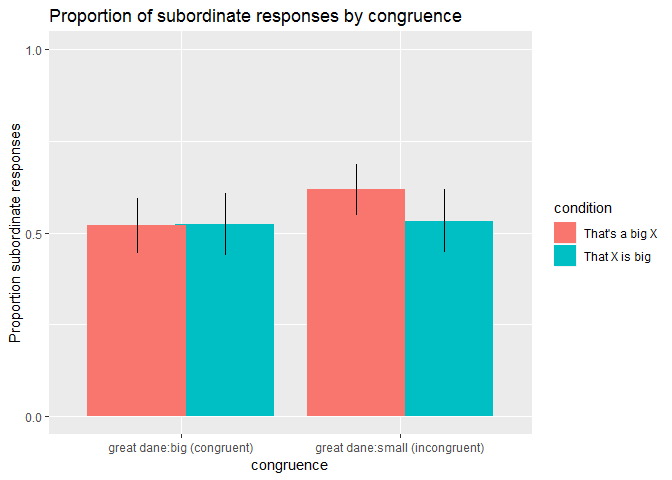
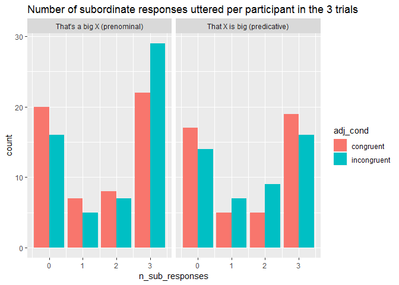
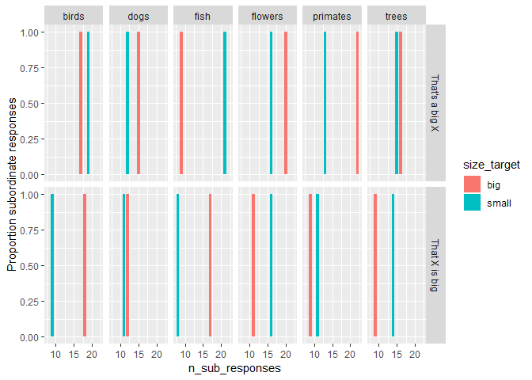
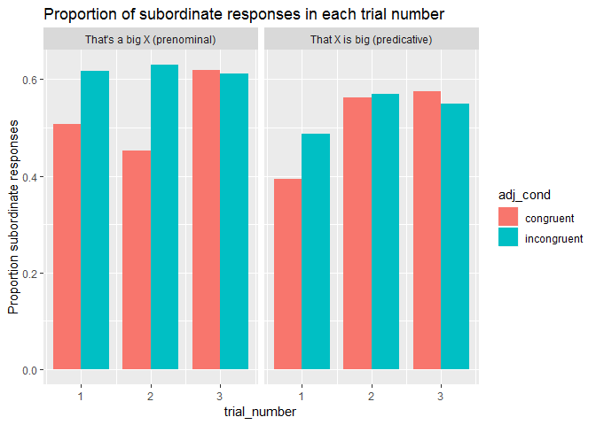

Comparison Class Elicitation With Different Adjective Informativity
================
Polina Tsvilodub
7/29/2019

# Experiment outline

This script analyses the data from a comparison class elicitation pilot
experiment with different adjective and target pais (n=113).

We expect *more subordinate labels to occur in the incongruent
condition*. In contrast, we expect *a similar proportion of
superordinate and subordinate labels as in the previous experiment in
the congruent condition*. Overall proportion of *subordinate labels
should be higher in the predicative condition*.

### Procedure

The pairings of the target and the adjective are altered in this
experiment: i. e. in the congruent condition, if target is a chihuahua,
the sentence includes the adjective “small”, if it is a great dane, it
includes “big”. In the incongruent (critical) condition, if the target
is a chihuahua, the sentence includes the adjective “big”, if the target
is a great dane, it includes “small”.Every subject view three congruent
and three incongruent conditions, randomly matched to three big and
three small
    targets.

## Data analysis

``` r
library(tidyverse)
```

    ## -- Attaching packages --------------------------------------- tidyverse 1.2.1 --

    ## v ggplot2 3.1.0     v purrr   0.2.5
    ## v tibble  1.4.2     v dplyr   0.7.7
    ## v tidyr   0.8.2     v stringr 1.3.1
    ## v readr   1.1.1     v forcats 0.3.0

    ## -- Conflicts ------------------------------------------ tidyverse_conflicts() --
    ## x dplyr::filter() masks stats::filter()
    ## x dplyr::lag()    masks stats::lag()

``` r
library(tidyboot)
```

    ## Warning: package 'tidyboot' was built under R version 3.5.3

``` r
# read in data
d <- read_csv('./../data/results_5_comparison-class-prod-diff-adj_113.csv')
```

    ## Parsed with column specification:
    ## cols(
    ##   .default = col_character(),
    ##   submission_id = col_integer(),
    ##   experiment_id = col_integer(),
    ##   enjoyment = col_integer(),
    ##   age = col_integer(),
    ##   trial_number = col_integer(),
    ##   startTime = col_double(),
    ##   attempts = col_integer(),
    ##   fairprice = col_double()
    ## )

    ## See spec(...) for full column specifications.

``` r
#first look at the data
glimpse(d)
```

    ## Observations: 2,073
    ## Variables: 42
    ## $ submission_id   <int> 100, 100, 100, 100, 100, 100, 100, 100, 100, 1...
    ## $ response1       <chr> "dog", "chihuahua", "swordfish", "monkey", "sp...
    ## $ size_adj        <chr> NA, NA, NA, NA, NA, "small", "small", "small",...
    ## $ startDate       <chr> "Wed Jul 31 2019 11:53:05 GMT-0400 (Eastern Da...
    ## $ context_picture <chr> NA, NA, NA, NA, NA, "images/monkey-parade-smal...
    ## $ experiment_id   <int> 5, 5, 5, 5, 5, 5, 5, 5, 5, 5, 5, 5, 5, 5, 5, 5...
    ## $ picture2        <chr> "images/great-dane.jpg", "images/great-dane.jp...
    ## $ correct1        <chr> "chihuahua", "chihuahua", "swordfish", "spider...
    ## $ question1       <chr> "This is a", "This is a", "This is a", "This i...
    ## $ problems        <chr> "no", "no", "no", "no", "no", "no", "no", "no"...
    ## $ enjoyment       <int> 2, 2, 2, 2, 2, 2, 2, 2, 2, 2, 2, 2, 2, 2, 2, 2...
    ## $ hit_id          <chr> "335VBRURDJOE9EVRVJQFWHY22NYE93", "335VBRURDJO...
    ## $ item            <chr> "dogs", "dogs", "fish", "primates", "primates"...
    ## $ botresponse     <chr> "mary", "mary", "mary", "mary", "mary", "mary"...
    ## $ assignment_id   <chr> "3SLE99ER0O1YVMZDFSNQWHQYZNOZB9", "3SLE99ER0O1...
    ## $ correct2        <chr> "great dane", "great dane", "goldfish", "goril...
    ## $ understand      <chr> "yes", "yes", "yes", "yes", "yes", "yes", "yes...
    ## $ text            <chr> "Please label the pictures below.", "Please la...
    ## $ condition       <chr> NA, NA, NA, NA, NA, "prenominal", "prenominal"...
    ## $ sentence        <chr> NA, NA, NA, NA, NA, "You say to your friend:",...
    ## $ age             <int> 26, 26, 26, 26, 26, 26, 26, 26, 26, 26, 26, 26...
    ## $ response        <chr> NA, NA, NA, NA, NA, "spider monkey", "pug", "s...
    ## $ comments        <chr> NA, NA, NA, NA, NA, NA, NA, NA, NA, NA, NA, NA...
    ## $ picture1        <chr> "images/chihuahua.jpg", "images/chihuahua.jpg"...
    ## $ response3       <chr> "dogs", "dogs", "fish", "apes", "apes", NA, NA...
    ## $ size_target     <chr> NA, NA, NA, NA, NA, "small", "big", "big", NA,...
    ## $ education       <chr> "graduated_college", "graduated_college", "gra...
    ## $ worker_id       <chr> "AE63GABJL0FGJ", "AE63GABJL0FGJ", "AE63GABJL0F...
    ## $ languages       <chr> "English", "English", "English", "English", "E...
    ## $ sex             <chr> "female", "female", "female", "female", "femal...
    ## $ RT              <chr> NA, NA, NA, NA, NA, NA, NA, NA, NA, NA, NA, NA...
    ## $ correct3        <chr> "dogs", "dogs", "fish", "monkeys|apes|primates...
    ## $ context         <chr> NA, NA, NA, NA, NA, "You see a group of animal...
    ## $ trial_number    <int> 1, 1, 2, 3, 3, 1, 2, 3, 1, 1, 2, 3, 3, 1, 2, 3...
    ## $ startTime       <dbl> 1.564588e+12, 1.564588e+12, 1.564588e+12, 1.56...
    ## $ attempts        <int> 1, 2, 1, 1, 2, NA, NA, NA, 1, 2, 1, 1, 2, NA, ...
    ## $ picture         <chr> NA, NA, NA, NA, NA, "images/spidermonkey.jpg",...
    ## $ fairprice       <dbl> 1.1, 1.1, 1.1, 1.1, 1.1, 1.1, 1.1, 1.1, 1.1, 1...
    ## $ question2       <chr> "These are both", "These are both", "These are...
    ## $ response2       <chr> "dog", "great dane", "goldfish", "gorilla", "g...
    ## $ adj_cond        <chr> NA, NA, NA, NA, NA, "congruent", "incongruent"...
    ## $ trial_name      <chr> "warmup", "warmup", "warmup", "warmup", "warmu...

``` r
# comments
d_comments <- d %>%
  distinct(submission_id, problems, comments, fairprice)
```

A few participants had issues submitting the experiment the first time,
so they retried it (submission\_id: 120, 130, 79), they will be excluded
from the analysis. One participant had issues with the framing of the
views.

The participants recruited via MTurk were paid $1.10.

\#\#Spliting data into main and warm-up, excluding participants Data
from n = 110 participants will be analysed.

7 participants are excluded because of their native language. There are
participants using upper case in the bot captcha, but they are not
excluded in this analysis.

``` r
# make sure how participants indicate their native language 
# sometimes participants use only "en" or "eng" for english
# excluded non-native speakers 
d %>% distinct(d$languages) %>% View()
d_langs <- d %>% mutate(
  languages = ifelse(languages == "Englishj", "English", languages)
) %>% mutate(
  languages = ifelse(is.na(languages), "X", languages)
) 

d_filt <- d %>% 
  filter(grepl("English", languages, ignore.case = T)) %>%
  filter((submission_id != 120)& (submission_id != 130)&(submission_id != 79)) %>%
  select(submission_id, trial_name, trial_number, size_adj, item, botresponse, response, response1, response2, response3, correct1, correct2, correct3, condition, size_target, attempts, adj_cond)

glimpse(d_filt)
```

    ## Observations: 1,897
    ## Variables: 17
    ## $ submission_id <int> 100, 100, 100, 100, 100, 100, 100, 100, 100, 100...
    ## $ trial_name    <chr> "warmup", "warmup", "warmup", "warmup", "warmup"...
    ## $ trial_number  <int> 1, 1, 2, 3, 3, 1, 2, 3, 1, 1, 2, 3, 3, 1, 2, 3, ...
    ## $ size_adj      <chr> NA, NA, NA, NA, NA, "small", "small", "small", N...
    ## $ item          <chr> "dogs", "dogs", "fish", "primates", "primates", ...
    ## $ botresponse   <chr> "mary", "mary", "mary", "mary", "mary", "mary", ...
    ## $ response      <chr> NA, NA, NA, NA, NA, "spider monkey", "pug", "swo...
    ## $ response1     <chr> "dog", "chihuahua", "swordfish", "monkey", "spid...
    ## $ response2     <chr> "dog", "great dane", "goldfish", "gorilla", "gor...
    ## $ response3     <chr> "dogs", "dogs", "fish", "apes", "apes", NA, NA, ...
    ## $ correct1      <chr> "chihuahua", "chihuahua", "swordfish", "spider m...
    ## $ correct2      <chr> "great dane", "great dane", "goldfish", "gorilla...
    ## $ correct3      <chr> "dogs", "dogs", "fish", "monkeys|apes|primates",...
    ## $ condition     <chr> NA, NA, NA, NA, NA, "prenominal", "prenominal", ...
    ## $ size_target   <chr> NA, NA, NA, NA, NA, "small", "big", "big", NA, N...
    ## $ attempts      <int> 1, 2, 1, 1, 2, NA, NA, NA, 1, 2, 1, 1, 2, NA, NA...
    ## $ adj_cond      <chr> NA, NA, NA, NA, NA, "congruent", "incongruent", ...

``` r
# extract main trials 
d_main <- d_filt %>% 
  filter(trial_name == "main") %>%
  select(submission_id, trial_number, response, size_adj, item, condition, size_target, adj_cond)

# extract warm-up trials 
d_warmup <- d_filt %>% filter(trial_name =="warmup") %>% 
  select(submission_id, trial_number, attempts, response1, correct1, response2, correct2, response3, correct3, item, botresponse)

# NB: in the warmup trials, trial_number includes two distinct trials (first block, second block), i.e. trial_number 1 is both the first warm-up view of the first and the second warm-up block
d_warmup %>%
  group_by(submission_id, trial_number, correct3) %>%
  count() %>%
  ungroup() %>%
  tidyboot_mean(column = n) # calculate mean of attempts participants needed for the warm-up completion
```

    ## # A tibble: 1 x 5
    ##       n empirical_stat ci_lower  mean ci_upper
    ##   <int>          <dbl>    <dbl> <dbl>    <dbl>
    ## 1   618           2.07     1.93  2.07     2.22

On average, participants had to re-enter the labels twice per two
warm-up views, meaning that they corrected they initial answer once to
proceed to the next view.

## Categorizing the data

Two responses to be excluded from the analysis: “herd of primates”,
“collection of
plants”

``` r
# question1 and question2 are the sentence parts coded in the experiment 
# look at the different responses provided and categorize them 
d_main %>% distinct(d_main$response) 
```

    ## # A tibble: 60 x 1
    ##    `d_main$response`
    ##    <chr>            
    ##  1 spider monkey    
    ##  2 pug              
    ##  3 swordfish        
    ##  4 daisy            
    ##  5 hummingbird      
    ##  6 redwood          
    ##  7 monkey           
    ##  8 chiuaha          
    ##  9 swan             
    ## 10 sunflower        
    ## # ... with 50 more rows

``` r
d_main$response[d_main$response=="herd of primates"]<- NA
d_main$response[d_main$response=="collection of plants"]<- NA

d_main_responseCat <- d_main %>% 
  rowwise() %>%
  mutate( # categorize responses 
    response_cat = ifelse(
      tolower(response) %in% c("ape", "primate", "bird", "dog", "fish", "flower", "monkey", "tree", "plant", "dig", "money", "puppy"), "super", "sub"),
    response_num = ifelse(response_cat == "sub", 1, 0),
    response_label = "sub"
  )
```

## Proportion of subordinate responses by condition, separated by congruency

The proportion of subordinate responses is the dependent variable we
test by manipulating the syntactic condition: “That’s a big X”
(prenominal) versus “That X is big” (predicative).

``` r
d_main_summary <- d_main_responseCat %>%
  group_by(condition, response_label, adj_cond) %>%
  tidyboot_mean(column = response_num) %>% # calculate proportion of subordinate labels in the different conditions 
  ungroup() %>%
  mutate(condition = factor(condition, 
                            levels = c("prenominal", "predicative"),
                            labels= c("That's a big X", "That X is big")),
         congruence = factor(adj_cond,
                           levels = c("congruent", "incongruent"),
                           labels = c("great dane:big (congruent)", "great dane:small (incongruent)")))
```

    ## Warning: Grouping rowwise data frame strips rowwise nature

``` r
ggplot(d_main_summary, aes(x = condition, fill = congruence,
                           y = mean, ymin = ci_lower, ymax = ci_upper))+
  geom_col(position = position_dodge(0.8))+
  geom_linerange(position = position_dodge(0.8))+
  labs( y = "Proportion subordinate responses")+
  scale_y_continuous(limits = c(0, 1), breaks = c(0, 0.5, 1))+
  ggtitle("The proportion of subordinate responses by syntactic condition")
```

<!-- -->
The surprising observation here is that the overall proportion of
subordinate responses ih higher than in the previous experiment.

## Proportion of subordinate responses by congruence

``` r
d_main_congr <- d_main_responseCat %>%
  group_by(adj_cond, condition, response_label) %>%
  tidyboot_mean(column = response_num) %>% # calculate proportion of subordinate labels in the different conditions 
  ungroup() %>%
  mutate(condition = factor(condition, 
                            levels = c("prenominal", "predicative"),
                            labels= c("That's a big X", "That X is big")),
         congruence = factor(adj_cond,
                           levels = c("congruent", "incongruent"),
                           labels = c("great dane:big (congruent)", "great dane:small (incongruent)")))
```

    ## Warning: Grouping rowwise data frame strips rowwise nature

``` r
ggplot(d_main_congr, aes(x = congruence, fill = condition,
                           y = mean, ymin = ci_lower, ymax = ci_upper))+
  geom_col(position = position_dodge(0.8))+
  geom_linerange(position = position_dodge(0.8))+
  labs( y = "Proportion subordinate responses")+
  scale_y_continuous(limits = c(0, 1), breaks = c(0, 0.5, 1))+
  ggtitle("Proportion of subordinate responses by congruence")
```

<!-- -->
The peculiar observation is that the proportions in the congruent trials
(same as previous experiment) are equal in both conditions now. Maybe
there is a priming effect of the incongruent trials if they preceed in
the trial sequence? The prevalence of subordinates in the prenominal
condition in the incongruent trials seems to support the hypothesis: the
comparison class is restricted to the NP here, so the subordinate is
used to preserve the truth condition of the preposition.

## Proportion of subordinate labels in big vs. small trials

We check if there is any proportional difference between the trials with
different target size. The size does not seem to have a significant
effect.

``` r
d_main_responseCat %>% group_by(size_target, adj_cond) %>% count()
```

    ## Warning: Grouping rowwise data frame strips rowwise nature

    ## # A tibble: 4 x 3
    ## # Groups:   size_target, adj_cond [4]
    ##   size_target adj_cond        n
    ##   <chr>       <chr>       <int>
    ## 1 big         congruent     161
    ## 2 big         incongruent   148
    ## 3 small       congruent     148
    ## 4 small       incongruent   161

``` r
d_main_summary_bySize <- d_main_responseCat %>%
  group_by(condition, size_target, adj_cond, response_label) %>%
  tidyboot_mean(column = response_num) %>%
  ungroup() %>%
  mutate(condition = factor(condition, 
                            levels = c("prenominal", "predicative"),
                            labels= c("That's a big X", "That X is big")))
```

    ## Warning: Grouping rowwise data frame strips rowwise nature

``` r
# big and small indicate the size of the target here 
ggplot(d_main_summary_bySize, aes(x = adj_cond, fill = condition, 
                           y = mean, ymin = ci_lower, ymax = ci_upper))+
  geom_col(position = position_dodge(0.8), width = 0.8)+
  geom_linerange(position = position_dodge(0.8))+
  labs( y = "Proportion subordinate responses")+
  facet_wrap(~size_target)+
  scale_y_continuous(limits = c(0, 1), breaks = c(0, 0.5, 1))+ ggtitle("Proportions in trials grouped by target size")
```

<!-- -->
Interestingly, small targets seem to elicit less subordinates in the
predicative condition (more sensistive to syntactic structure), whereas
big targets elicit equal proportions in both conditions. Is there a
different prior of using positive adjectives (‘big’ as the incongruent
one in small trials) (in terms of informativity) than using negative
adjectives (incongruent ones in the big trials)? Is it ‘worse’ to say
“big chihuahua” in comparison to dogs than “small great dane” in
comparison to dogs? Also, the proportions reverse in the congruent
conditions depending on the target size\! This should not be the case\!
People rather say “That’s a big great dane” (\>0.5), but perform as
expected in the predicative condition (0.5). Again, different prior
expectations of positive vs negative feature expression on a scale? In
the small trials, they perform as expected (predicative \> prenominal).

Does this positive/negative adj/feature difference exist on other
scales?

## Proportion depending on adjective ‘big’ versus ‘small’

``` r
d_main_summary_byAdj <- d_main_responseCat %>%
  group_by(condition, size_adj, adj_cond, response_label) %>%
  tidyboot_mean(column = response_num) %>%
  ungroup() %>%
  mutate(condition = factor(condition, 
                            levels = c("prenominal", "predicative"),
                            labels= c("That's a big X", "That X is big")))
```

    ## Warning: Grouping rowwise data frame strips rowwise nature

``` r
# big and small indicate the adjective actually used 
ggplot(d_main_summary_byAdj, aes(x = adj_cond, fill = condition, 
                           y = mean, ymin = ci_lower, ymax = ci_upper))+
  geom_col(position = position_dodge(0.8), width = 0.8)+
  geom_linerange(position = position_dodge(0.8))+
  labs( y = "Proportion subordinate responses")+
  facet_wrap(~size_adj)+
  scale_y_continuous(limits = c(0, 1), breaks = c(0, 0.5, 1)) + ggtitle("Proportions in trials grouped by adjective used")
```

<!-- -->
Grouped this way, we see some evidence for difference depending on the
adjective. Prenominal condiion seems to be particularly salient in the
incongruent ‘big’ condition. Isn’t it strange: ‘That dog is big’ is
rather used for a chihuahua than ‘That chihuahua is big’.

## Consistency of choosing a response category by subject

Do participants switch between superordinate and subordinate labels
within the experiment?

``` r
d_main_responseCat %>%
  group_by(submission_id, adj_cond, condition, response_label) %>%
  summarize(n_sub_responses = sum(response_num)) %>%
  ungroup() %>%
  mutate(condition = factor(condition, 
                            levels = c("prenominal", "predicative"),
                            labels= c("That's a big X (prenominal)", "That X is big (predicative)"))) %>%
  ggplot(., aes( x = n_sub_responses, fill = adj_cond))+
  geom_bar(position=position_dodge())+
  facet_wrap(~condition) + ggtitle("Number of subordinate responses uttered per participant in the 3 trials")
```

    ## Warning: Grouping rowwise data frame strips rowwise nature

<!-- -->
There are many people in the congruent condition consistently using
subordinates in the prenominal condition, but also some not using them
at all. Incongruent trials seem to be as expected.

## Proportion of subordinate responses by item (context)

For each context, there is a pair of targets (a big and a small one).
The targets seem to elicit different proportions of subordinate lables.
The most effective ones seem to be the swan, the chihuahua and the
bonsai. However, the results are not robust due to a small sample size.

``` r
d_main_responseCat %>% count(item, condition) %>% glimpse()
```

    ## Warning: Grouping rowwise data frame strips rowwise nature

    ## Observations: 12
    ## Variables: 3
    ## $ item      <chr> "birds", "birds", "dogs", "dogs", "fish", "fish", "f...
    ## $ condition <chr> "predicative", "prenominal", "predicative", "prenomi...
    ## $ n         <int> 46, 57, 46, 57, 46, 57, 46, 57, 46, 57, 46, 57

``` r
d_main_responseCat %>%
  group_by(condition, item, size_adj, size_target, response_label) %>%
  tidyboot_mean(column = response_num) %>%
  ungroup() %>%
  mutate(condition = factor(condition, 
                            levels = c("prenominal", "predicative"),
                            labels= c("That's a big X", "That X is big"))) %>%

# big and small indicate the adjective actually used 
ggplot(., aes(x = size_target, fill = size_adj, 
                           y = mean, ymin = ci_lower, ymax = ci_upper))+
  geom_col(position = position_dodge(0.8), width = 0.8)+
  geom_linerange(position = position_dodge(0.8))+
  labs( y = "Proportion subordinate responses")+
  facet_grid(condition~item)+
  scale_y_continuous(limits = c(0, 1), breaks = c(0, 0.5, 1))
```

    ## Warning: Grouping rowwise data frame strips rowwise nature

<!-- -->

``` r
# leave this grouping or interchange adj_cond and condition?
```

``` r
d_main_responseCat %>%
  group_by(condition, item, size_target, response_label) %>%
  summarize(n_sub_responses = sum(response_num)) %>%
  ungroup() %>%
  mutate(condition = factor(condition, 
                            levels = c("prenominal", "predicative"),
                            labels= c("That's a big X", "That X is big"))
         ) %>%

# big and small indicate the adjective actually used 
ggplot(., aes(x = n_sub_responses, fill = size_target
                        ))+
  geom_bar(position = position_dodge(0.8), width = 0.8)+
 
  labs( y = "Proportion subordinate responses")+
  facet_grid(condition~item)
```

    ## Warning: Grouping rowwise data frame strips rowwise nature

<!-- -->

## Order effects

``` r
d_main_responseCat %>% group_by(size_target, response_cat, adj_cond) %>% count() 
```

    ## Warning: Grouping rowwise data frame strips rowwise nature

    ## # A tibble: 8 x 4
    ## # Groups:   size_target, response_cat, adj_cond [8]
    ##   size_target response_cat adj_cond        n
    ##   <chr>       <chr>        <chr>       <int>
    ## 1 big         sub          congruent      87
    ## 2 big         sub          incongruent    88
    ## 3 big         super        congruent      74
    ## 4 big         super        incongruent    60
    ## 5 small       sub          congruent      74
    ## 6 small       sub          incongruent    91
    ## 7 small       super        congruent      74
    ## 8 small       super        incongruent    70

In the incongruent trials, prenominal condition, people seem to get more
sensitive with trial progress in general.

``` r
d_main_responseCat %>% 
  group_by(trial_number, adj_cond, condition, response_label) %>%
  tidyboot_mean(column = response_num) %>%
  ungroup() %>%
  mutate(condition = factor(condition, 
                            levels = c("prenominal", "predicative"),
                            labels= c("That's a big X (prenominal)", "That X is big (predicative)"))) %>%

# big and small indicate the adjective actually used 
ggplot(., aes(x = trial_number,  
                           y = mean, fill=adj_cond))+
  geom_col(position = position_dodge(0.8), width = 0.8)+
  #geom_linerange(position = position_dodge(0.8))+
  labs( y = "Proportion subordinate responses")+
  facet_wrap(~condition) + ggtitle("Proportion of subordinate responses in each trial number")
```

    ## Warning: Grouping rowwise data frame strips rowwise nature

<!-- -->
There is a constantly high sub proportion in incongruent prenominal
condition. Proportion in congruent trials is much higher in third trial,
probably being primed. Proportions in the predicative condition are as
expected.

BTW, is it possible that people start to get more insensitive to
prenominal condition in congruent trials because there is no clear
reference to “average” subordinate size? I. e. being primed, people
produce ‘That’s a big great dane’ because there is no benchmark for an
average great dane (hard without direct visual reference).

There is definetly a difference to proportions in the first experiment
(added). There is a steady decrease in subs in the prenominal condition,
increase in predicative condition (makes sense).

## Order effects

``` r
d_main_seq <- d_main_responseCat %>% mutate(
  sequence = if((trial_number == 1) & (adj_cond == "incongruent")) {"A"}
  else if ((trial_number == 2) & (adj_cond == "incongruent")){"B"}  
  else if((trial_number == 3) & (adj_cond == "incongruent")) {"C"}
  else {"D" }
) 
```

## Trials having an incongruent trial at the beginnning

``` r
# filter the subjects who have a first incongruent trial 
ids_A <- d_main_seq %>% group_by(submission_id, sequence) %>% filter(sequence =="A") %>% select(submission_id)
```

    ## Warning: Grouping rowwise data frame strips rowwise nature

    ## Adding missing grouping variables: `sequence`

``` r
# look at the trials which start with A 
d_main_seq %>% group_by(submission_id) %>% filter(submission_id %in% ids_A$submission_id) %>%
  group_by(trial_number, adj_cond, condition, response_label) %>%
  tidyboot_mean(column = response_num) %>%
  ungroup() %>%
  mutate(condition = factor(condition, 
                            levels = c("prenominal", "predicative"),
                            labels= c("That's a big X", "That X is big"))) %>%
ggplot(., aes(x = trial_number,  
                           y = mean, fill=adj_cond))+
  geom_col(position = position_dodge(0.8), width = 0.8)+
  labs( y = "Proportion subordinate responses")+
  facet_wrap(~condition) + ggtitle("Proportion of subordinate responses in trials beginning with an incongruent trial")
```

    ## Warning: Grouping rowwise data frame strips rowwise nature

<!-- -->
There are still congruent trials in the first position because subjects
have two first trials (first and second
block).

## Proportion of subordinate responses in subjects starting with a congruent trial

``` r
# filter the subjects who have a congruent first trial

ids_D <- d_main_seq %>% group_by(submission_id, trial_number, sequence)%>%count()%>%  filter(sequence =="D") %>% filter(trial_number ==1) %>%  select(submission_id)
```

    ## Warning: Grouping rowwise data frame strips rowwise nature

    ## Adding missing grouping variables: `trial_number`, `sequence`

``` r
# look at the trials which start with D
d_main_seq %>% group_by(submission_id) %>% filter(submission_id %in% ids_D$submission_id) %>%
  group_by(trial_number, adj_cond, condition, response_label) %>%
  tidyboot_mean(column = response_num) %>%
  ungroup() %>%
  mutate(condition = factor(condition, 
                            levels = c("prenominal", "predicative"),
                            labels= c("That's a big X", "That X is big"))) %>%
ggplot(., aes(x = trial_number,  
                           y = mean, fill=adj_cond))+
  geom_col(position = position_dodge(0.8), width = 0.8)+
  labs( y = "Proportion subordinate responses")+
  facet_wrap(~condition) + ggtitle("Proportion of subordinate responses in trials beginning with a congruent trial")
```

    ## Warning: Grouping rowwise data frame strips rowwise nature

<!-- -->

## Proportions in subjects starting with two incongruent trials

There is an increase in the congruent trials subordinate proportion,
indicating a role of incongruent trials preceding the congruent
ones.

``` r
ids_AB <- d_main_seq %>% group_by(submission_id, trial_number, sequence)%>%count() %>% filter(trial_number ==1|trial_number==2) %>%  filter(sequence=="A"|sequence=="B") %>%select(submission_id)
```

    ## Warning: Grouping rowwise data frame strips rowwise nature

    ## Adding missing grouping variables: `trial_number`, `sequence`

``` r
# look at the trials which start with D
d_main_seq %>% group_by(submission_id) %>% filter(submission_id %in% ids_AB$submission_id) %>%
  group_by(trial_number, adj_cond, condition, response_label) %>%
  tidyboot_mean(column = response_num) %>%
  ungroup() %>%
  mutate(condition = factor(condition, 
                            levels = c("prenominal", "predicative"),
                            labels= c("That's a big X", "That X is big"))) %>%
ggplot(., aes(x = trial_number,  
                           y = mean, fill=adj_cond))+
  geom_col(position = position_dodge(0.8), width = 0.8)+
  labs( y = "Proportion subordinate responses")+
  facet_wrap(~condition) + ggtitle("Proportion of subordinate responses in trials beginning with either of first two being incongruent trials")
```

    ## Warning: Grouping rowwise data frame strips rowwise nature

<!-- -->
It is not clear whether there is a stronger effect on congruent trials
if two incongruent trials preceed.
