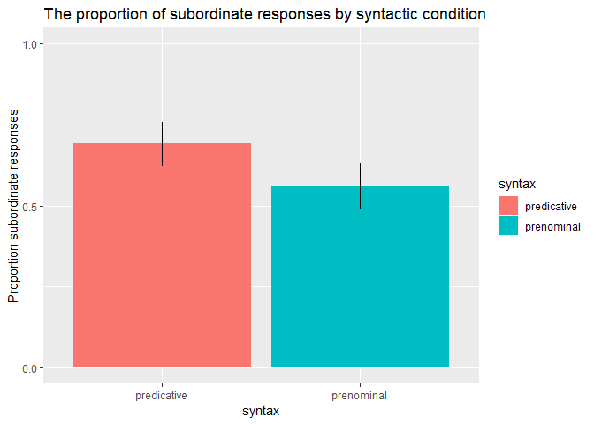
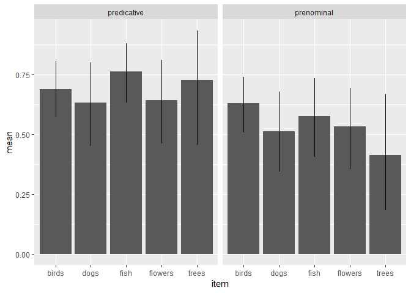
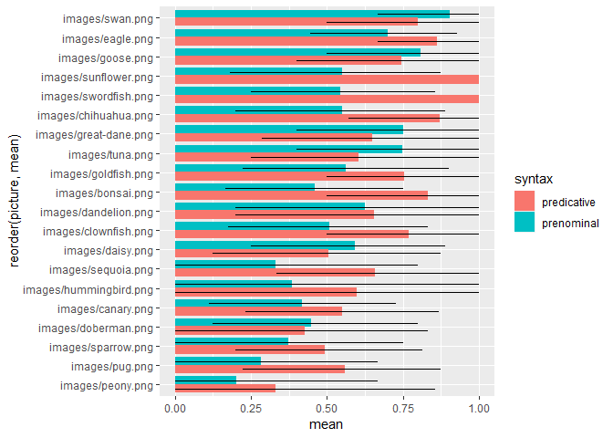

Comparison Class Production Full Data Analysis
================
Polina Tsvilodub
8/12/2019

## Experiment outline

This script analyses the data from a comparison class production
experiment with (n=X).

In a between-subject design we manipulate the syntactic frame in which
the subjects elicit the comparison class with respect to size of a
target obejct: “That X is big” (predicative condition) and “That’s a big
X” (prenominal condition). We use both adjectives ‘big’ and ‘small’,
depending on the target. The targets are chosen such that they are
obviously big (or small) members of their superordinate category, but
normal-sized for their subordinate category. A stimulus consists of a
context group, for example different-sized dogs (superordinate
category), and the target, a normal-sized great dane (a big dog) or a
normal-sized chihuahua (a small dog) (subordinate categories).

Due to syntactic frame manipulation, the participans are expected to use
different comparison classes (superordinate labels versus subordinate
labels of the target) in order to communicate the situation presented to
them in the stimulus.

We expect *more superordinate labels to occur in the prenominal
condition*, since the NP restricts the comparison class more strongly to
the category used in the NP. In contrast, we expect *a similar
proportion of superordinate and subordinate labels in the predicative
condition*, since the comparison class is less
    restricted.

# Data analysis

``` r
library(tidyverse)
```

    ## -- Attaching packages ----------------------------------------------------- tidyverse 1.2.1 --

    ## v ggplot2 3.1.0     v purrr   0.2.5
    ## v tibble  1.4.2     v dplyr   0.7.7
    ## v tidyr   0.8.2     v stringr 1.3.1
    ## v readr   1.1.1     v forcats 0.3.0

    ## -- Conflicts -------------------------------------------------------- tidyverse_conflicts() --
    ## x dplyr::filter() masks stats::filter()
    ## x dplyr::lag()    masks stats::lag()

``` r
library(tidyboot)
```

    ## Warning: package 'tidyboot' was built under R version 3.5.3

``` r
# read in data
d1 <- read_csv('./../data/results_8_exp1-post-prereg-pred.csv')
```

    ## Parsed with column specification:
    ## cols(
    ##   .default = col_character(),
    ##   submission_id = col_integer(),
    ##   experiment_id = col_integer(),
    ##   enjoyment = col_integer(),
    ##   age = col_integer(),
    ##   trial_number = col_integer(),
    ##   startTime = col_double(),
    ##   attempts = col_integer(),
    ##   fairprice = col_double()
    ## )

    ## See spec(...) for full column specifications.

``` r
d2 <- read_csv('./../data/results_10_exp1-post-prereg-prenom.csv')
```

    ## Parsed with column specification:
    ## cols(
    ##   .default = col_character(),
    ##   submission_id = col_integer(),
    ##   experiment_id = col_integer(),
    ##   enjoyment = col_integer(),
    ##   age = col_integer(),
    ##   trial_number = col_integer(),
    ##   startTime = col_double(),
    ##   attempts = col_integer(),
    ##   fairprice = col_double()
    ## )
    ## See spec(...) for full column specifications.

``` r
d <- rbind(d1, d2)

#first look at the data
glimpse(d)
```

    ## Observations: 1,029
    ## Variables: 41
    ## $ submission_id   <int> 341, 341, 341, 341, 341, 341, 341, 341, 341, 3...
    ## $ response1       <chr> "swordfish", "tall tree", "cedar", "pine", "tr...
    ## $ startDate       <chr> "Wed Aug 21 2019 14:55:05 GMT-0500 (CDT)", "We...
    ## $ context_picture <chr> NA, NA, NA, NA, NA, NA, NA, NA, NA, NA, NA, NA...
    ## $ experiment_id   <int> 8, 8, 8, 8, 8, 8, 8, 8, 8, 8, 8, 8, 8, 8, 8, 8...
    ## $ picture2        <chr> "warmup/goldfish.png", "warmup/bonsai.jpg", "w...
    ## $ correct1        <chr> "swordfish", "redwood|sequoia", "redwood|sequo...
    ## $ question1       <chr> "This is a", "This is a", "This is a", "This i...
    ## $ problems        <chr> "no", "no", "no", "no", "no", "no", "no", "no"...
    ## $ enjoyment       <int> 1, 1, 1, 1, 1, 1, 1, 1, 1, 1, 1, 1, 1, 1, 1, 1...
    ## $ hit_id          <chr> "3ZZAYRN1I6FJ5KHUN3YSSTTS1K6OTT", "3ZZAYRN1I6F...
    ## $ item            <chr> "fish", "trees", "trees", "trees", "trees", "t...
    ## $ botresponse     <chr> "susan", "susan", "susan", "susan", "susan", "...
    ## $ assignment_id   <chr> "3S4AW7T80C6U5YX0LCMUGO9UECL4LV", "3S4AW7T80C6...
    ## $ correct2        <chr> "goldfish", "bonsai", "bonsai", "bonsai", "bon...
    ## $ understand      <chr> "yes", "yes", "yes", "yes", "yes", "yes", "yes...
    ## $ text            <chr> "Please label the pictures below.", "Please la...
    ## $ condition       <chr> NA, NA, NA, NA, NA, NA, NA, NA, NA, NA, NA, NA...
    ## $ sentence        <chr> NA, NA, NA, NA, NA, NA, NA, NA, NA, NA, NA, NA...
    ## $ age             <int> 65, 65, 65, 65, 65, 65, 65, 65, 65, 65, 65, 65...
    ## $ response        <chr> NA, NA, NA, NA, NA, NA, NA, NA, NA, NA, NA, NA...
    ## $ comments        <chr> NA, NA, NA, NA, NA, NA, NA, NA, NA, NA, NA, NA...
    ## $ picture1        <chr> "warmup/swordfish.jpg", "warmup/sequoia.jpg", ...
    ## $ response3       <chr> "fish", "trees", "trees", "trees", "trees", "e...
    ## $ education       <chr> "graduated_college", "graduated_college", "gra...
    ## $ worker_id       <chr> "A2BLQ1GVEHJR8T", "A2BLQ1GVEHJR8T", "A2BLQ1GVE...
    ## $ languages       <chr> "English", "English", "English", "English", "E...
    ## $ sex             <chr> "female", "female", "female", "female", "femal...
    ## $ RT              <chr> NA, NA, NA, NA, NA, NA, NA, NA, NA, NA, NA, NA...
    ## $ correct3        <chr> "fish", "trees", "trees", "trees", "trees", "t...
    ## $ context         <chr> NA, NA, NA, NA, NA, NA, NA, NA, NA, NA, NA, NA...
    ## $ trial_number    <int> 1, 2, 2, 2, 2, 2, 2, 2, 2, 2, 3, 3, 1, 2, 3, 1...
    ## $ startTime       <dbl> 1.566417e+12, 1.566417e+12, 1.566417e+12, 1.56...
    ## $ attempts        <int> 1, 1, 2, 3, 4, 5, 6, 7, 8, 9, 1, 2, NA, NA, NA...
    ## $ picture         <chr> NA, NA, NA, NA, NA, NA, NA, NA, NA, NA, NA, NA...
    ## $ question3       <chr> "This is a", "This is a", "This is a", "This i...
    ## $ fairprice       <dbl> 1.00, 1.00, 1.00, 1.00, 1.00, 1.00, 1.00, 1.00...
    ## $ question2       <chr> "These are both", "These are both", "These are...
    ## $ size            <chr> NA, NA, NA, NA, NA, NA, NA, NA, NA, NA, NA, NA...
    ## $ response2       <chr> "goldfish", "bonsai", "bonsai", "bonsai", "bon...
    ## $ trial_name      <chr> "warmup1", "warmup1", "warmup1", "warmup1", "w...

``` r
# comments
d_comments <- d %>%
  distinct(submission_id, problems, comments, fairprice)

# number of big / small targets per condition
d %>% group_by(condition, size) %>% count()
```

    ## # A tibble: 5 x 3
    ## # Groups:   condition, size [5]
    ##   condition   size      n
    ##   <chr>       <chr> <int>
    ## 1 predicative big      90
    ## 2 predicative small    90
    ## 3 prenominal  big      90
    ## 4 prenominal  small    90
    ## 5 <NA>        <NA>    669

The participants recruited via MTurk were paid $1.00.

\#\#Spliting data into main and warm-up, excluding participants

Subject exclusion

``` r
# make sure how participants indicate their native language 
# sometimes participants use only "en" or "eng" for english
# excluded non-native speakers 
d %>% distinct(d$languages) %>% View()


d_filt <- d %>% 
  filter(grepl("eng", languages, ignore.case = T)) %>%
  select(submission_id, trial_name, trial_number, size, item, botresponse, response, condition,  picture) %>% mutate(size=factor(size), syntax = factor(condition))

glimpse(d_filt)
```

    ## Observations: 1,029
    ## Variables: 10
    ## $ submission_id <int> 341, 341, 341, 341, 341, 341, 341, 341, 341, 341...
    ## $ trial_name    <chr> "warmup1", "warmup1", "warmup1", "warmup1", "war...
    ## $ trial_number  <int> 1, 2, 2, 2, 2, 2, 2, 2, 2, 2, 3, 3, 1, 2, 3, 1, ...
    ## $ size          <fct> NA, NA, NA, NA, NA, NA, NA, NA, NA, NA, NA, NA, ...
    ## $ item          <chr> "fish", "trees", "trees", "trees", "trees", "tre...
    ## $ botresponse   <chr> "susan", "susan", "susan", "susan", "susan", "su...
    ## $ response      <chr> NA, NA, NA, NA, NA, NA, NA, NA, NA, NA, NA, NA, ...
    ## $ condition     <chr> NA, NA, NA, NA, NA, NA, NA, NA, NA, NA, NA, NA, ...
    ## $ picture       <chr> NA, NA, NA, NA, NA, NA, NA, NA, NA, NA, NA, NA, ...
    ## $ syntax        <fct> NA, NA, NA, NA, NA, NA, NA, NA, NA, NA, NA, NA, ...

``` r
# exclude participants if necessary based on botcaptcha 
d_filt %>% distinct(d_filt$botresponse) %>% View()

# extract main trials 
d_main <- d_filt %>% filter((trial_name =="main1") | (trial_name== "main2")  ) %>% 
  select(submission_id, trial_number, response,  size, item, syntax, picture)
```

## Categorizing the data

``` r
# question1 and question2 are the sentence parts coded in the experiment 
# look at the different responses provided and categorize them 
d_main %>% distinct(d_main$response) %>% View()

# exclude if responses are not referring to the target 
d_main_valid <- subset(d_main, !(response %in% c("rose", "duck"))) 

d_main_responseCat <- d_main_valid %>%
  rowwise() %>%
  mutate( # categorize responses 
    response_cat =
      ifelse(
      tolower(response) %in% c("bird", "birds", "dog", "dogs", "fish","one plant", "flower", "flowers", "tree", "trees", "animal", "plant"), "super", "sub"),
    
    resp_cat = ifelse(response_cat == "sub", 1, 0),
    response_label = "sub"
  )
```

## Response category distribution

``` r
d_main_responseCat %>% mutate(condition = factor(syntax, 
                            levels = c("prenominal", "predicative"),
                            labels= c("That's a big X", "That X is big"))) %>% ggplot(aes(x=response_cat, fill=response_cat)) +geom_bar(position=position_dodge()) + facet_wrap(~syntax)
```

<!-- -->

## Proportion of subordinate responses by condition, separated by congruency

The proportion of subordinate responses is the dependent variable we
test by manipulating the syntactic condition: “That’s a big X”
(prenominal) versus “That X is big” (predicative).

``` r
d_main_summary <- d_main_responseCat %>%
  group_by(syntax, response_label) %>%
  tidyboot_mean(column = resp_cat) %>% # calculate proportion of subordinate labels in the different conditions 
  ungroup() %>%
  mutate(condition = factor(syntax, 
                            levels = c("prenominal", "predicative"),
                            labels= c("That's a big X", "That X is big"))
        )
```

    ## Warning: Grouping rowwise data frame strips rowwise nature

``` r
ggplot(d_main_summary, aes(x = syntax, fill = syntax,
                           y = mean, ymin = ci_lower, ymax = ci_upper))+
  geom_col(position = position_dodge(0.8))+
  geom_linerange(position = position_dodge(0.8))+
  labs( y = "Proportion subordinate responses")+
  scale_y_continuous(limits = c(0, 1), breaks = c(0, 0.5, 1))+
  ggtitle("The proportion of subordinate responses by syntactic condition")
```

<!-- -->

## Bayesian stats

``` r
library(brms)
```

    ## Warning: package 'brms' was built under R version 3.5.3

    ## Loading required package: Rcpp

    ## Loading 'brms' package (version 2.8.0). Useful instructions
    ## can be found by typing help('brms'). A more detailed introduction
    ## to the package is available through vignette('brms_overview').

``` r
# effect coding
#contrasts(d_main_responseCat$syntax)=contr.sum(2)
contrasts(d_main_responseCat$syntax)=matrix(c(-1, 1))
# fit regression model
lm.bayes <- brm(resp_cat ~ syntax + (1| submission_id) + (1 + syntax|picture), data = d_main_responseCat, family = "bernoulli")
```

    ## Compiling the C++ model

    ## Start sampling

    ## 
    ## SAMPLING FOR MODEL '1b1423e832ba07da4efffd5a83eb433e' NOW (CHAIN 1).
    ## Chain 1: 
    ## Chain 1: Gradient evaluation took 0.033 seconds
    ## Chain 1: 1000 transitions using 10 leapfrog steps per transition would take 330 seconds.
    ## Chain 1: Adjust your expectations accordingly!
    ## Chain 1: 
    ## Chain 1: 
    ## Chain 1: Iteration:    1 / 2000 [  0%]  (Warmup)
    ## Chain 1: Iteration:  200 / 2000 [ 10%]  (Warmup)
    ## Chain 1: Iteration:  400 / 2000 [ 20%]  (Warmup)
    ## Chain 1: Iteration:  600 / 2000 [ 30%]  (Warmup)
    ## Chain 1: Iteration:  800 / 2000 [ 40%]  (Warmup)
    ## Chain 1: Iteration: 1000 / 2000 [ 50%]  (Warmup)
    ## Chain 1: Iteration: 1001 / 2000 [ 50%]  (Sampling)
    ## Chain 1: Iteration: 1200 / 2000 [ 60%]  (Sampling)
    ## Chain 1: Iteration: 1400 / 2000 [ 70%]  (Sampling)
    ## Chain 1: Iteration: 1600 / 2000 [ 80%]  (Sampling)
    ## Chain 1: Iteration: 1800 / 2000 [ 90%]  (Sampling)
    ## Chain 1: Iteration: 2000 / 2000 [100%]  (Sampling)
    ## Chain 1: 
    ## Chain 1:  Elapsed Time: 13.187 seconds (Warm-up)
    ## Chain 1:                6.684 seconds (Sampling)
    ## Chain 1:                19.871 seconds (Total)
    ## Chain 1: 
    ## 
    ## SAMPLING FOR MODEL '1b1423e832ba07da4efffd5a83eb433e' NOW (CHAIN 2).
    ## Chain 2: 
    ## Chain 2: Gradient evaluation took 0 seconds
    ## Chain 2: 1000 transitions using 10 leapfrog steps per transition would take 0 seconds.
    ## Chain 2: Adjust your expectations accordingly!
    ## Chain 2: 
    ## Chain 2: 
    ## Chain 2: Iteration:    1 / 2000 [  0%]  (Warmup)
    ## Chain 2: Iteration:  200 / 2000 [ 10%]  (Warmup)
    ## Chain 2: Iteration:  400 / 2000 [ 20%]  (Warmup)
    ## Chain 2: Iteration:  600 / 2000 [ 30%]  (Warmup)
    ## Chain 2: Iteration:  800 / 2000 [ 40%]  (Warmup)
    ## Chain 2: Iteration: 1000 / 2000 [ 50%]  (Warmup)
    ## Chain 2: Iteration: 1001 / 2000 [ 50%]  (Sampling)
    ## Chain 2: Iteration: 1200 / 2000 [ 60%]  (Sampling)
    ## Chain 2: Iteration: 1400 / 2000 [ 70%]  (Sampling)
    ## Chain 2: Iteration: 1600 / 2000 [ 80%]  (Sampling)
    ## Chain 2: Iteration: 1800 / 2000 [ 90%]  (Sampling)
    ## Chain 2: Iteration: 2000 / 2000 [100%]  (Sampling)
    ## Chain 2: 
    ## Chain 2:  Elapsed Time: 10.835 seconds (Warm-up)
    ## Chain 2:                3.932 seconds (Sampling)
    ## Chain 2:                14.767 seconds (Total)
    ## Chain 2: 
    ## 
    ## SAMPLING FOR MODEL '1b1423e832ba07da4efffd5a83eb433e' NOW (CHAIN 3).
    ## Chain 3: 
    ## Chain 3: Gradient evaluation took 0 seconds
    ## Chain 3: 1000 transitions using 10 leapfrog steps per transition would take 0 seconds.
    ## Chain 3: Adjust your expectations accordingly!
    ## Chain 3: 
    ## Chain 3: 
    ## Chain 3: Iteration:    1 / 2000 [  0%]  (Warmup)
    ## Chain 3: Iteration:  200 / 2000 [ 10%]  (Warmup)
    ## Chain 3: Iteration:  400 / 2000 [ 20%]  (Warmup)
    ## Chain 3: Iteration:  600 / 2000 [ 30%]  (Warmup)
    ## Chain 3: Iteration:  800 / 2000 [ 40%]  (Warmup)
    ## Chain 3: Iteration: 1000 / 2000 [ 50%]  (Warmup)
    ## Chain 3: Iteration: 1001 / 2000 [ 50%]  (Sampling)
    ## Chain 3: Iteration: 1200 / 2000 [ 60%]  (Sampling)
    ## Chain 3: Iteration: 1400 / 2000 [ 70%]  (Sampling)
    ## Chain 3: Iteration: 1600 / 2000 [ 80%]  (Sampling)
    ## Chain 3: Iteration: 1800 / 2000 [ 90%]  (Sampling)
    ## Chain 3: Iteration: 2000 / 2000 [100%]  (Sampling)
    ## Chain 3: 
    ## Chain 3:  Elapsed Time: 12.966 seconds (Warm-up)
    ## Chain 3:                9.661 seconds (Sampling)
    ## Chain 3:                22.627 seconds (Total)
    ## Chain 3: 
    ## 
    ## SAMPLING FOR MODEL '1b1423e832ba07da4efffd5a83eb433e' NOW (CHAIN 4).
    ## Chain 4: 
    ## Chain 4: Gradient evaluation took 0 seconds
    ## Chain 4: 1000 transitions using 10 leapfrog steps per transition would take 0 seconds.
    ## Chain 4: Adjust your expectations accordingly!
    ## Chain 4: 
    ## Chain 4: 
    ## Chain 4: Iteration:    1 / 2000 [  0%]  (Warmup)
    ## Chain 4: Iteration:  200 / 2000 [ 10%]  (Warmup)
    ## Chain 4: Iteration:  400 / 2000 [ 20%]  (Warmup)
    ## Chain 4: Iteration:  600 / 2000 [ 30%]  (Warmup)
    ## Chain 4: Iteration:  800 / 2000 [ 40%]  (Warmup)
    ## Chain 4: Iteration: 1000 / 2000 [ 50%]  (Warmup)
    ## Chain 4: Iteration: 1001 / 2000 [ 50%]  (Sampling)
    ## Chain 4: Iteration: 1200 / 2000 [ 60%]  (Sampling)
    ## Chain 4: Iteration: 1400 / 2000 [ 70%]  (Sampling)
    ## Chain 4: Iteration: 1600 / 2000 [ 80%]  (Sampling)
    ## Chain 4: Iteration: 1800 / 2000 [ 90%]  (Sampling)
    ## Chain 4: Iteration: 2000 / 2000 [100%]  (Sampling)
    ## Chain 4: 
    ## Chain 4:  Elapsed Time: 9.815 seconds (Warm-up)
    ## Chain 4:                16.355 seconds (Sampling)
    ## Chain 4:                26.17 seconds (Total)
    ## Chain 4:

``` r
summary(lm.bayes)
```

    ##  Family: bernoulli 
    ##   Links: mu = logit 
    ## Formula: resp_cat ~ syntax + (1 | submission_id) + (1 + syntax | picture) 
    ##    Data: d_main_responseCat (Number of observations: 358) 
    ## Samples: 4 chains, each with iter = 2000; warmup = 1000; thin = 1;
    ##          total post-warmup samples = 4000
    ## 
    ## Group-Level Effects: 
    ## ~picture (Number of levels: 20) 
    ##                        Estimate Est.Error l-95% CI u-95% CI Eff.Sample
    ## sd(Intercept)              2.09      0.73     0.99     3.85        906
    ## sd(syntax1)                0.97      0.65     0.05     2.56        949
    ## cor(Intercept,syntax1)    -0.57      0.40    -0.99     0.53       1816
    ##                        Rhat
    ## sd(Intercept)          1.00
    ## sd(syntax1)            1.00
    ## cor(Intercept,syntax1) 1.00
    ## 
    ## ~submission_id (Number of levels: 60) 
    ##               Estimate Est.Error l-95% CI u-95% CI Eff.Sample Rhat
    ## sd(Intercept)     8.01      2.25     4.72    13.37        887 1.01
    ## 
    ## Population-Level Effects: 
    ##           Estimate Est.Error l-95% CI u-95% CI Eff.Sample Rhat
    ## Intercept     2.41      1.42    -0.05     5.32        665 1.01
    ## syntax1      -1.34      1.29    -4.05     1.04        647 1.01
    ## 
    ## Samples were drawn using sampling(NUTS). For each parameter, Eff.Sample 
    ## is a crude measure of effective sample size, and Rhat is the potential 
    ## scale reduction factor on split chains (at convergence, Rhat = 1).

``` r
#extract posterior samples
pos_samples <- posterior_samples(lm.bayes)
head(pos_samples)
```

    ##   b_Intercept  b_syntax1 sd_picture__Intercept sd_picture__syntax1
    ## 1  -0.6069777 -1.3605751              2.421321         0.248672631
    ## 2   1.0240916 -1.5752040              1.865097         0.871985934
    ## 3   0.3869019 -1.7227852              2.039390         0.860294896
    ## 4   1.2285444 -0.9324021              1.277030         0.237970461
    ## 5   0.5167319 -2.4668491              1.606047         0.008253354
    ## 6   2.0685298 -2.9092213              2.502766         0.092590337
    ##   sd_submission_id__Intercept cor_picture__Intercept__syntax1
    ## 1                    8.443533                      -0.4303850
    ## 2                    5.779745                      -0.9686911
    ## 3                    5.920074                      -0.9864481
    ## 4                    4.610969                       0.6360107
    ## 5                    7.326748                      -0.6550096
    ## 6                    9.191469                      -0.2137374
    ##   r_picture[images/bonsai.png,Intercept]
    ## 1                             -1.5102593
    ## 2                              1.9052256
    ## 3                              0.5108611
    ## 4                             -1.5166871
    ## 5                              0.7700007
    ## 6                             -1.5615930
    ##   r_picture[images/canary.png,Intercept]
    ## 1                            -1.13474345
    ## 2                            -0.06566937
    ## 3                            -1.58552851
    ## 4                            -0.25375755
    ## 5                             0.33583303
    ## 6                            -3.35590786
    ##   r_picture[images/chihuahua.png,Intercept]
    ## 1                                 3.2955902
    ## 2                                 0.2815835
    ## 3                                 1.6724400
    ## 4                                 0.4180942
    ## 5                                 0.6673077
    ## 6                                 2.8439913
    ##   r_picture[images/clownfish.png,Intercept]
    ## 1                                0.50730234
    ## 2                               -0.55488386
    ## 3                                0.06854348
    ## 4                               -1.08465808
    ## 5                                0.11754574
    ## 6                               -0.54752121
    ##   r_picture[images/daisy.png,Intercept]
    ## 1                            -0.7427875
    ## 2                            -3.0720329
    ## 3                            -1.5481912
    ## 4                            -1.6057888
    ## 5                            -1.2724659
    ## 6                            -2.9416173
    ##   r_picture[images/dandelion.png,Intercept]
    ## 1                                 2.4460125
    ## 2                                 1.8706546
    ## 3                                 0.9332960
    ## 4                                 2.5078689
    ## 5                                 0.5118831
    ## 6                                 2.3491424
    ##   r_picture[images/doberman.png,Intercept]
    ## 1                                0.4897745
    ## 2                               -1.7485152
    ## 3                               -2.4497177
    ## 4                               -1.8583302
    ## 5                                0.6630063
    ## 6                               -3.6038509
    ##   r_picture[images/eagle.png,Intercept]
    ## 1                              4.579780
    ## 2                              0.811071
    ## 3                              4.230041
    ## 4                              1.756848
    ## 5                              2.556923
    ## 6                              3.011079
    ##   r_picture[images/goldfish.png,Intercept]
    ## 1                                0.8351257
    ## 2                                0.3604484
    ## 3                                0.3804231
    ## 4                               -1.6431807
    ## 5                                0.9771208
    ## 6                               -1.3484451
    ##   r_picture[images/goose.png,Intercept]
    ## 1                             3.5205260
    ## 2                             0.2411789
    ## 3                             1.6128095
    ## 4                             1.5360672
    ## 5                            -1.2670480
    ## 6                             5.7328937
    ##   r_picture[images/great-dane.png,Intercept]
    ## 1                                -0.09166918
    ## 2                                 1.93687367
    ## 3                                 3.29621195
    ## 4                                 0.59116424
    ## 5                                 1.08009240
    ## 6                                -1.62467549
    ##   r_picture[images/hummingbird.png,Intercept]
    ## 1                                  -0.1539821
    ## 2                                  -0.3773624
    ## 3                                   1.0051573
    ## 4                                   0.7114380
    ## 5                                  -0.7131813
    ## 6                                  -0.2423431
    ##   r_picture[images/peony.png,Intercept]
    ## 1                            -2.5344598
    ## 2                            -0.9769405
    ## 3                            -1.4011906
    ## 4                            -1.2553857
    ## 5                            -1.7292507
    ## 6                            -0.5285016
    ##   r_picture[images/pug.png,Intercept]
    ## 1                           1.1631894
    ## 2                          -1.8508239
    ## 3                           0.2274556
    ## 4                          -1.5573894
    ## 5                          -0.3047360
    ## 6                          -0.6584431
    ##   r_picture[images/sequoia.png,Intercept]
    ## 1                               2.1559183
    ## 2                              -0.2635824
    ## 3                              -0.1621076
    ## 4                               1.6486269
    ## 5                               1.2479303
    ## 6                               0.2058790
    ##   r_picture[images/sparrow.png,Intercept]
    ## 1                             -0.77256813
    ## 2                             -1.11404623
    ## 3                             -2.57560471
    ## 4                              0.02250674
    ## 5                             -1.26392175
    ## 6                             -0.56637624
    ##   r_picture[images/sunflower.png,Intercept]
    ## 1                                 3.1867608
    ## 2                                 0.6937841
    ## 3                                 1.6621805
    ## 4                                 0.5026891
    ## 5                                 1.7144827
    ## 6                                 1.3425008
    ##   r_picture[images/swan.png,Intercept]
    ## 1                            3.0562869
    ## 2                            1.8812020
    ## 3                            0.3851649
    ## 4                            0.8219146
    ## 5                            1.6164331
    ## 6                            3.8214330
    ##   r_picture[images/swordfish.png,Intercept]
    ## 1                                 3.0559626
    ## 2                                 1.3056398
    ## 3                                 0.8637411
    ## 4                                 0.7804342
    ## 5                                 2.6610991
    ## 6                                 0.3156249
    ##   r_picture[images/tuna.png,Intercept]
    ## 1                            3.7695678
    ## 2                            0.6257632
    ## 3                            1.3973512
    ## 4                            0.4394171
    ## 5                            3.1798409
    ## 6                            0.7498197
    ##   r_picture[images/bonsai.png,syntax1]
    ## 1                         -0.250272035
    ## 2                         -0.704873408
    ## 3                         -0.124719630
    ## 4                         -0.436882608
    ## 5                          0.001373155
    ## 6                          0.039801039
    ##   r_picture[images/canary.png,syntax1]
    ## 1                          0.270927797
    ## 2                          0.120467229
    ## 3                          0.824327797
    ## 4                         -0.273343949
    ## 5                          0.004448856
    ## 6                         -0.078914273
    ##   r_picture[images/chihuahua.png,syntax1]
    ## 1                            -0.182794969
    ## 2                            -0.334049336
    ## 3                            -0.797059863
    ## 4                             0.137820649
    ## 5                            -0.004326896
    ## 6                             0.020555327
    ##   r_picture[images/clownfish.png,syntax1]
    ## 1                            2.578038e-02
    ## 2                            4.455000e-01
    ## 3                            2.606731e-01
    ## 4                           -3.754055e-01
    ## 5                           -7.657146e-05
    ## 6                            2.477354e-02
    ##   r_picture[images/daisy.png,syntax1]
    ## 1                        -0.184199107
    ## 2                         1.724622916
    ## 3                         0.819971587
    ## 4                        -0.468656832
    ## 5                        -0.002897302
    ## 6                         0.022488940
    ##   r_picture[images/dandelion.png,syntax1]
    ## 1                            -0.325557225
    ## 2                            -0.600028588
    ## 3                            -0.406855907
    ## 4                             0.314137159
    ## 5                            -0.001606651
    ## 6                             0.076169428
    ##   r_picture[images/doberman.png,syntax1]
    ## 1                           -0.074232828
    ## 2                            0.933113220
    ## 3                            0.917206092
    ## 4                           -0.069796090
    ## 5                           -0.008912688
    ## 6                            0.100442635
    ##   r_picture[images/eagle.png,syntax1]
    ## 1                         -0.49944500
    ## 2                         -0.14833422
    ## 3                         -1.74401823
    ## 4                          0.03773225
    ## 5                         -0.01662980
    ## 6                          0.05733500
    ##   r_picture[images/goldfish.png,syntax1]
    ## 1                           6.200311e-02
    ## 2                          -2.729734e-01
    ## 3                          -1.360448e-01
    ## 4                          -3.137452e-01
    ## 5                          -9.782287e-05
    ## 6                           8.363201e-02
    ##   r_picture[images/goose.png,syntax1]
    ## 1                         0.296627474
    ## 2                        -0.323728572
    ## 3                        -0.707052330
    ## 4                         0.310665869
    ## 5                         0.002097127
    ## 6                         0.050798686
    ##   r_picture[images/great-dane.png,syntax1]
    ## 1                             -0.029253609
    ## 2                             -0.529431688
    ## 3                             -1.199291389
    ## 4                             -0.342013274
    ## 5                             -0.002468132
    ## 6                             -0.017113418
    ##   r_picture[images/hummingbird.png,syntax1]
    ## 1                                0.01935932
    ## 2                                0.05671320
    ## 3                               -0.63693999
    ## 4                                0.20056616
    ## 5                                0.01198549
    ## 6                               -0.09227069
    ##   r_picture[images/peony.png,syntax1] r_picture[images/pug.png,syntax1]
    ## 1                        0.0160325930                       0.070119473
    ## 2                        0.4793380386                       0.589933396
    ## 3                        0.6894628719                       0.047096438
    ## 4                       -0.4055177176                      -0.109053444
    ## 5                       -0.0003673728                       0.002460471
    ## 6                       -0.1017240256                      -0.071946744
    ##   r_picture[images/sequoia.png,syntax1]
    ## 1                          -0.169721001
    ## 2                           0.155424021
    ## 3                           0.134040073
    ## 4                           0.341601040
    ## 5                          -0.004022743
    ## 6                           0.025440922
    ##   r_picture[images/sparrow.png,syntax1]
    ## 1                          0.1652523350
    ## 2                          0.4505270882
    ## 3                          1.0215469678
    ## 4                         -0.1133684391
    ## 5                         -0.0001926433
    ## 6                          0.2171940584
    ##   r_picture[images/sunflower.png,syntax1]
    ## 1                            0.0897772824
    ## 2                           -0.5476330065
    ## 3                           -0.8932074971
    ## 4                            0.2266058876
    ## 5                           -0.0001406133
    ## 6                            0.0978996417
    ##   r_picture[images/swan.png,syntax1]
    ## 1                        0.206408057
    ## 2                       -1.041502198
    ## 3                       -0.317445872
    ## 4                        0.161400944
    ## 5                       -0.003132213
    ## 6                       -0.178718393
    ##   r_picture[images/swordfish.png,syntax1]
    ## 1                             0.081295015
    ## 2                            -0.785798240
    ## 3                            -0.356809414
    ## 4                             0.020917622
    ## 5                            -0.001849995
    ## 6                            -0.045505145
    ##   r_picture[images/tuna.png,syntax1] r_submission_id[285,Intercept]
    ## 1                       -0.174136944                       7.298990
    ## 2                       -0.367521816                      10.526450
    ## 3                       -0.734135544                       9.522093
    ## 4                        0.158425567                       2.728160
    ## 5                       -0.014269907                       1.720464
    ## 6                        0.003905598                       8.425300
    ##   r_submission_id[286,Intercept] r_submission_id[287,Intercept]
    ## 1                     -12.344285                      -3.080820
    ## 2                      -7.274380                     -15.765653
    ## 3                      -6.000383                     -11.726970
    ## 4                      -8.295847                     -11.179255
    ## 5                     -15.252840                      -2.216459
    ## 6                     -10.001911                      -6.062200
    ##   r_submission_id[288,Intercept] r_submission_id[289,Intercept]
    ## 1                       6.726984                    10.94688474
    ## 2                       4.964756                     9.85950621
    ## 3                       6.374768                     0.02654786
    ## 4                       7.184662                     5.82605805
    ## 5                      11.836527                    11.40797320
    ## 6                       8.786674                     5.82741450
    ##   r_submission_id[290,Intercept] r_submission_id[291,Intercept]
    ## 1                      -5.868064                     -0.1096678
    ## 2                      -5.321361                      1.1771604
    ## 3                      -9.447920                     -0.6829958
    ## 4                      -2.011678                      0.3746919
    ## 5                     -10.094378                     -3.4517991
    ## 6                     -15.385739                     -2.3315723
    ##   r_submission_id[292,Intercept] r_submission_id[293,Intercept]
    ## 1                     -14.197308                      -7.202912
    ## 2                      -4.638667                      -4.198860
    ## 3                      -8.016655                      -5.023544
    ## 4                      -5.001001                      -4.701103
    ## 5                      -8.900949                      -3.501545
    ## 6                      -8.800428                      -7.056163
    ##   r_submission_id[294,Intercept] r_submission_id[295,Intercept]
    ## 1                      -3.325695                     1.32803232
    ## 2                      -6.567172                    -0.89742891
    ## 3                      -6.756282                    -0.43182894
    ## 4                      -3.157858                     0.09283896
    ## 5                      -7.213200                    -0.85865547
    ## 6                      -9.671903                    -0.20135163
    ##   r_submission_id[296,Intercept] r_submission_id[297,Intercept]
    ## 1                      4.3992904                      11.156866
    ## 2                      2.3301601                       3.007513
    ## 3                      4.8436211                       6.899418
    ## 4                      1.8333761                       2.104968
    ## 5                     10.1326402                       3.124993
    ## 6                     -0.2966059                      10.518556
    ##   r_submission_id[298,Intercept] r_submission_id[299,Intercept]
    ## 1                      11.025518                      -6.732805
    ## 2                       2.629316                     -10.731054
    ## 3                       5.814829                     -10.985662
    ## 4                       3.295914                      -5.207176
    ## 5                       9.413441                     -10.749654
    ## 6                       8.376583                     -10.592771
    ##   r_submission_id[300,Intercept] r_submission_id[301,Intercept]
    ## 1                     -6.1721363                      7.8636319
    ## 2                     -3.9406316                      4.0076839
    ## 3                     -0.3532015                      0.9286448
    ## 4                     -6.2402448                      6.0695252
    ## 5                     -1.4043573                      1.8787607
    ## 6                    -12.4655607                     22.8921242
    ##   r_submission_id[302,Intercept] r_submission_id[303,Intercept]
    ## 1                     -1.9748670                     -2.7649680
    ## 2                      1.0004156                     -1.6316009
    ## 3                      1.4831826                     -0.4916803
    ## 4                     -2.4398553                     -2.2580640
    ## 5                      0.3189542                     -2.0438615
    ## 6                     -4.9518491                     -4.5302977
    ##   r_submission_id[304,Intercept] r_submission_id[305,Intercept]
    ## 1                     -0.4244008                     -1.8325314
    ## 2                      3.9880929                      0.3242184
    ## 3                      1.9375769                      2.0700037
    ## 4                     -0.6506842                     -0.9435089
    ## 5                     -0.5396891                      1.5883851
    ## 6                     -2.8904886                      0.5550030
    ##   r_submission_id[306,Intercept] r_submission_id[307,Intercept]
    ## 1                     -0.4891014                       2.933073
    ## 2                      0.6898703                       0.741653
    ## 3                      1.2862216                       1.157354
    ## 4                     -0.8626659                       1.563148
    ## 5                      0.8119762                       1.193205
    ## 6                     -1.5816032                       2.203605
    ##   r_submission_id[308,Intercept] r_submission_id[309,Intercept]
    ## 1                       4.957772                      -9.770812
    ## 2                       6.927747                      -2.264903
    ## 3                       3.442273                      -4.189587
    ## 4                       7.523523                      -2.902474
    ## 5                       5.228445                      -7.998514
    ## 6                      15.766059                      -4.716549
    ##   r_submission_id[310,Intercept] r_submission_id[311,Intercept]
    ## 1                    -0.01817629                      1.8761603
    ## 2                     0.74053034                      0.8638179
    ## 3                     2.64101277                      3.7025758
    ## 4                    -0.74651306                      0.8175378
    ## 5                     2.63010058                      2.8177233
    ## 6                     0.65058509                      2.7278318
    ##   r_submission_id[312,Intercept] r_submission_id[313,Intercept]
    ## 1                      15.308853                     -4.6394443
    ## 2                       1.342873                     -1.0256228
    ## 3                       5.286977                     -1.8913168
    ## 4                       4.592317                      0.2054498
    ## 5                       1.698964                     -1.6087975
    ## 6                       6.827140                      0.6613127
    ##   r_submission_id[314,Intercept] r_submission_id[315,Intercept]
    ## 1                      -9.732873                      14.961329
    ## 2                     -10.412882                       5.271811
    ## 3                     -10.776912                       4.439781
    ## 4                      -4.878558                       2.503465
    ## 5                     -11.204913                       8.134868
    ## 6                     -12.529844                       1.930361
    ##   r_submission_id[316,Intercept] r_submission_id[317,Intercept]
    ## 1                     11.6007234                     -1.5028767
    ## 2                     -0.4335637                     -2.0895561
    ## 3                      6.0206249                     -2.8389613
    ## 4                      4.6011593                      1.3458734
    ## 5                      0.5414119                     -3.8307297
    ## 6                      5.1065277                     -0.7507758
    ##   r_submission_id[318,Intercept] r_submission_id[319,Intercept]
    ## 1                      4.0402100                      -1.046444
    ## 2                      5.5862907                       2.567756
    ## 3                      7.6621115                       1.265543
    ## 4                      0.7294676                      -1.720601
    ## 5                      8.7896488                       1.439427
    ## 6                     -0.7635445                      -1.291670
    ##   r_submission_id[320,Intercept] r_submission_id[321,Intercept]
    ## 1                      5.0308613                      -6.421937
    ## 2                      2.8248234                     -13.197340
    ## 3                      5.2506338                     -11.724072
    ## 4                      1.5172086                      -9.817741
    ## 5                      5.2584856                      -8.503819
    ## 6                     -0.2517701                     -19.649349
    ##   r_submission_id[322,Intercept] r_submission_id[323,Intercept]
    ## 1                       3.251919                      14.883885
    ## 2                      11.653924                       4.610668
    ## 3                      13.327353                       5.010535
    ## 4                       4.686465                       6.507085
    ## 5                       6.625368                      13.346831
    ## 6                       7.379451                       8.548957
    ##   r_submission_id[324,Intercept] r_submission_id[325,Intercept]
    ## 1                      8.7641301                       6.088505
    ## 2                      7.8399778                       5.504928
    ## 3                     10.0941374                       9.973437
    ## 4                      6.7232082                       1.608877
    ## 5                      5.5784603                      13.198265
    ## 6                      0.5071949                       7.102646
    ##   r_submission_id[326,Intercept] r_submission_id[327,Intercept]
    ## 1                    -21.9508966                       4.332837
    ## 2                      0.1410502                       7.906196
    ## 3                     -6.6368510                       3.695525
    ## 4                     -5.3265577                       6.718022
    ## 5                     -4.0474781                      10.921265
    ## 6                    -10.7432126                      10.146464
    ##   r_submission_id[328,Intercept] r_submission_id[329,Intercept]
    ## 1                       4.669625                       7.497936
    ## 2                       4.740413                       4.859171
    ## 3                       4.690759                       8.295275
    ## 4                       4.595972                       3.203614
    ## 5                       3.363125                      10.401782
    ## 6                       6.343880                       4.978755
    ##   r_submission_id[330,Intercept] r_submission_id[331,Intercept]
    ## 1                     -2.4878906                    -13.1464711
    ## 2                     -1.8590570                     -0.5664298
    ## 3                     -0.9539088                     -6.1630274
    ## 4                     -2.8490027                     -1.7666355
    ## 5                     -1.7039958                     -7.7080969
    ## 6                     -8.0331366                    -14.1910720
    ##   r_submission_id[332,Intercept] r_submission_id[333,Intercept]
    ## 1                      2.5483124                       8.052911
    ## 2                      0.5252348                       3.942177
    ## 3                      0.6436274                       5.542710
    ## 4                      1.3611471                       6.423784
    ## 5                      0.5571896                       8.706741
    ## 6                      0.5392516                       3.152367
    ##   r_submission_id[334,Intercept] r_submission_id[335,Intercept]
    ## 1                       4.221587                       3.679854
    ## 2                       4.415666                       2.002547
    ## 3                       1.103979                       2.428118
    ## 4                       4.446481                       1.806509
    ## 5                       1.687730                       4.294374
    ## 6                       9.392456                       2.823516
    ##   r_submission_id[336,Intercept] r_submission_id[337,Intercept]
    ## 1                       2.697642                    -0.39846721
    ## 2                       9.271275                    -0.59077617
    ## 3                       8.852706                    -0.03240263
    ## 4                       6.438923                    -0.96197063
    ## 5                       3.763605                    -0.16622125
    ## 6                      13.091452                    -4.55450443
    ##   r_submission_id[338,Intercept] r_submission_id[339,Intercept]
    ## 1                      -2.220983                     -11.778846
    ## 2                      -4.568036                      -1.634769
    ## 3                      -3.368548                      -2.202561
    ## 4                      -1.480117                      -4.365064
    ## 5                      -4.976685                     -17.424097
    ## 6                      -4.608833                      -7.118404
    ##   r_submission_id[340,Intercept] r_submission_id[341,Intercept]
    ## 1                     -11.111793                      2.6462930
    ## 2                     -10.880794                     -0.9547713
    ## 3                      -9.331021                     -0.2533669
    ## 4                      -3.889898                      1.1037326
    ## 5                      -4.437929                     -2.5485426
    ## 6                      -4.973875                     -1.4963843
    ##   r_submission_id[342,Intercept] r_submission_id[343,Intercept]
    ## 1                       8.384552                    -0.09254653
    ## 2                       7.246046                     1.78055689
    ## 3                       6.866472                     1.17820056
    ## 4                       8.113152                     1.10858397
    ## 5                       4.944071                     0.66962502
    ## 6                      11.555403                     3.76755955
    ##   r_submission_id[344,Intercept]      lp__
    ## 1                       4.776744 -211.6924
    ## 2                       5.578573 -218.0962
    ## 3                       2.438876 -223.7430
    ## 4                       7.780507 -233.1106
    ## 5                       2.895185 -219.1309
    ## 6                      15.438269 -216.1084

``` r
# test hypothesis: is the sub response proportion credibly greater in the predicative condition?
mean(pos_samples$b_syntax1 > 0)
```

    ## [1] 0.126

## Proportion of sub reponses by item category

``` r
#d_main_responseCat %>% group_by(item, syntax, response_label) %>% summarise(nr_sub_resp# sum(resp_cat)) %>% ungroup() %>% ggplot(., aes(x = nr_sub_resp)) + geom_bar() + facet_grid(syntax~item)

# porportions of sub reponses instead of counts
d_main_responseCat %>% group_by(item, syntax, response_label) %>% tidyboot_mean(column = resp_cat) %>% ungroup() %>% ggplot(., aes(x = item, y = mean,  ymin = ci_lower, ymax = ci_upper)) + geom_col(position = position_dodge(0.8)) + geom_linerange(position = position_dodge(0.8)) + facet_wrap(~syntax)
```

    ## Warning: Grouping rowwise data frame strips rowwise nature

    ## Warning: Column `syntax` has different attributes on LHS and RHS of join

<!-- -->

## Proportion of sub reponses by single item (picture)

``` r
#d_main_responseCat %>% group_by(item, syntax, response_label, size) %>% summarise(nr_sub_resp = sum(resp_cat)) %>% ungroup() %>% ggplot(., aes(x = nr_sub_resp)) + geom_bar() + facet_grid(syntax + size ~item)

# proportion of sub reponses by picture
d_main_responseCat %>% group_by(picture, syntax, response_label) %>% tidyboot_mean(column = resp_cat) %>% ungroup() %>% ggplot(., aes(x = reorder(picture, mean), y = mean, fill=syntax, ymin = ci_lower, ymax = ci_upper)) + geom_col(position = position_dodge(0.8)) + geom_linerange(position = position_dodge(0.8))  + coord_flip() 
```

    ## Warning: Grouping rowwise data frame strips rowwise nature

    ## Warning: Column `syntax` has different attributes on LHS and RHS of join

<!-- -->

``` r
# + facet_wrap(~syntax)
```

## Number of sub responses per participant

``` r
d_main_responseCat %>%
  group_by(submission_id, syntax, response_label) %>%
  summarize(n_sub_responses = sum(resp_cat)) %>%
  ungroup() %>%
  ggplot(., aes( x = n_sub_responses))+
  geom_bar(position=position_dodge())+
  facet_wrap(~syntax) + ggtitle("Number of subordinate responses uttered per participant in the 6 trials")
```

    ## Warning: Grouping rowwise data frame strips rowwise nature

<!-- -->
