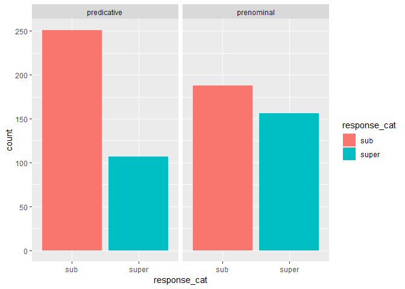
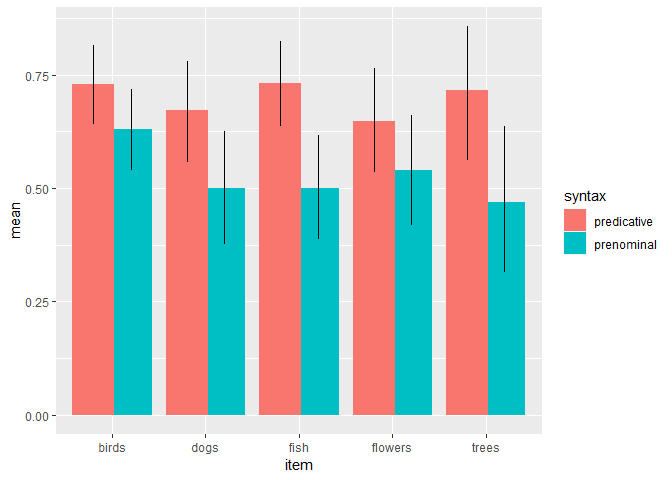
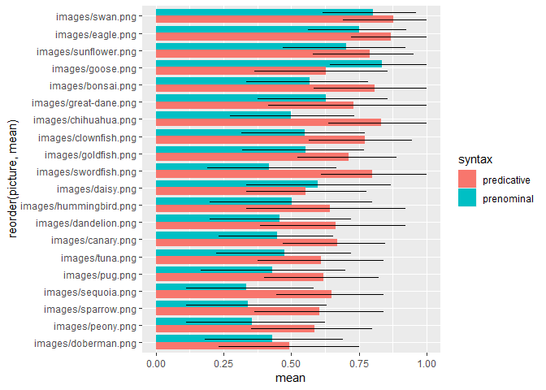
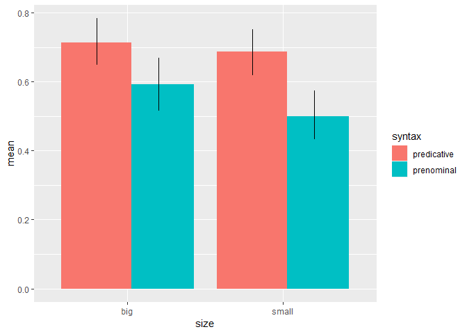

Adjective Comparison Class Free Production Experiment
================
Polina Tsvilodub
8/12/2019

# Introduction

This free production experiment is part of the adjective comparison
class studies, following up on promising pilot experiment results gained
in the same experimental setup.  
We investigate the hypothesis that NPs in a sentence can be employed
either referentially or predicatively and that different syntactic
frames suggest different functions for the NPs (reference
vs. predication). In particular, we hypothesize that **the NP of a
simple, copular sentence explicitly provides the comparison class of the
adjective when the NP is used predicatively** (and hence, the adjective
appears prenominally: “That’s a big NP”). **When the NP is used
referentially (and hence, the adjective appears in a predicative
position: “That NP is big”), the NP does not fix the comparison class**,
which allows other contextual circumstances to guide the inference about
the comparison class. This script analyses the data collected in two
batches of the adjective comparison class free production experiment.
The experiment and the analysis were preregistered prior to the first
recruitment of 60 participants on MTurk. Since the experiment has four
conditions, the data of 60 participants was not sufficient, so another
60 participants were recruited without another preregistration. The data
from 120 participants is analysed here. They were compensated $1.00 /
participant.

## Experiment design

Before the main trails, participants complete warm-up trials to get
faimiliar with subordinate-level labels of the main trial stimuli. They
label two instances of a basic level category (e. g. dogs) from
different subordinate level categories, e. g. a great dane and a pug
(both the great dane and the pug are also target referents in subsequent
main trials.) In the warm-up trial, participants provide the subordinate
level labels as well as a common, basic-level label (i.e. dogs) for the
instances shown. Participants are provided feedback. If participants
supply an incorrect label, they are required to correct the label before
proceeding. The experimental task is to describe an object. Participants
are presented a context picture of several members of a common
basic-level category, e. g. a parade of dogs. The parade includes three
different subordinate categories of the basic-level category (like dog),
e. g. a big, a middle-sized and a small dog breed like great danes,
poodles and chihuahuas. A representative of either the big or the small
breed is a target presented in another picture below the context picture
which the participant has to describe. We use both adjectives ‘big’ and
‘small’ (within-subject), consistent with the intuitive size of the
target. The targets are chosen such that they are obviously big (or
small) members of their basic-level category, but normal-sized for their
subordinate category. The participants are supposed to describe the
target referent (e. g. a great dane) by completing a sentence. The
syntax of the sentence is the main condition manipulated between
subjects. It has either the prenominal syntax “That’s a big \_” or the
predicative syntax “That \_ is big”, the blank to be filled in with a
noun phrase. In the prenominal condition, the NP is hypothesized to set
the adjective comparison class, i. e. inserting the basic-level label of
the referent means that the referent (e. g. a great dane) is “big in
comparison to other dogs”.  
Hence, we expect *more basic-level labels (‘dog’) to occur in the
prenominal condition*, since the NP restricts the comparison class more
strongly to the category used in the NP. In contrast, we expect *a
similar proportion of basic-level (‘dog’) and subordinate (‘great dane’)
labels in the predicative condition*, since the comparison class is less
restricted. Inserting both the basic-level and the subordinate label of
the target (e. g. great dane) could mean “big in comparison to other
dogs”.

# Data analysis

    ## -- Attaching packages ---------------------------------------------------- tidyverse 1.2.1 --

    ## v ggplot2 3.1.0     v purrr   0.2.5
    ## v tibble  1.4.2     v dplyr   0.7.7
    ## v tidyr   0.8.2     v stringr 1.3.1
    ## v readr   1.1.1     v forcats 0.3.0

    ## -- Conflicts ------------------------------------------------------- tidyverse_conflicts() --
    ## x dplyr::filter() masks stats::filter()
    ## x dplyr::lag()    masks stats::lag()

    ## Parsed with column specification:
    ## cols(
    ##   .default = col_character(),
    ##   submission_id = col_integer(),
    ##   experiment_id = col_integer(),
    ##   enjoyment = col_integer(),
    ##   age = col_integer(),
    ##   trial_number = col_integer(),
    ##   startTime = col_double(),
    ##   attempts = col_integer(),
    ##   fairprice = col_double()
    ## )

    ## See spec(...) for full column specifications.

    ## Parsed with column specification:
    ## cols(
    ##   .default = col_character(),
    ##   submission_id = col_integer(),
    ##   experiment_id = col_integer(),
    ##   enjoyment = col_integer(),
    ##   age = col_integer(),
    ##   trial_number = col_integer(),
    ##   startTime = col_double(),
    ##   attempts = col_integer(),
    ##   fairprice = col_double()
    ## )

    ## See spec(...) for full column specifications.

    ## Parsed with column specification:
    ## cols(
    ##   .default = col_character(),
    ##   submission_id = col_integer(),
    ##   experiment_id = col_integer(),
    ##   enjoyment = col_integer(),
    ##   age = col_integer(),
    ##   trial_number = col_integer(),
    ##   startTime = col_double(),
    ##   attempts = col_integer(),
    ##   fairprice = col_double()
    ## )

    ## See spec(...) for full column specifications.

    ## Parsed with column specification:
    ## cols(
    ##   .default = col_character(),
    ##   submission_id = col_integer(),
    ##   experiment_id = col_integer(),
    ##   enjoyment = col_integer(),
    ##   age = col_integer(),
    ##   trial_number = col_integer(),
    ##   startTime = col_double(),
    ##   attempts = col_integer(),
    ##   fairprice = col_double()
    ## )

    ## See spec(...) for full column specifications.

    ## # A tibble: 5 x 3
    ## # Groups:   condition, size [5]
    ##   condition   size      n
    ##   <chr>       <chr> <int>
    ## 1 predicative big     180
    ## 2 predicative small   180
    ## 3 prenominal  big     180
    ## 4 prenominal  small   180
    ## 5 <NA>        <NA>   1334

\#\#Spliting and filtering data Paticipants whose native language is not
English or the information is missing are excluded from the analysis.
Two participants were excluded.

    ## # A tibble: 7 x 1
    ##   `d$languages`   
    ##   <chr>           
    ## 1 English         
    ## 2 english         
    ## 3 ENGLISH         
    ## 4 Spanish, English
    ## 5 eng             
    ## 6 <NA>            
    ## 7 English, Spanish

## Categorizing the data

The responses produced by the participants are catgorized into
subordinate and basic-level labels of the target picture. The following
lemmas were categorized as basic-level responses: bird, dog, fish,
plant, flower, tree, animal. All other valid responses were categrpized
as subordinate labels. Six invalid data points like obviously wrong
labels or ungrammatical sentences are excluded.

## Proportion of subordinate responses by syntactic condition

The proportion of subordinate responses is the dependent variable we
test by manipulating the syntactic condition: “That’s a big \_\_”
(prenominal) versus “That \_\_ is big” (predicative). The proportion of
subordinate responses is higher in he predictaive than in the prenominal
condition, supporting the hypothesis that in the prenominal condition
rather basic-level labels are used in order to communicate the
comparison class. The overall proportion of subordinate responses is
above 50 % in both syntactic conditions, revealing participants’
preference for subordinate labels. The reason might be a general
preference for more specific comparison classes over more general
ones.  
<!-- -->
\#\# Bayesian model The logistic Bayesian regression model was
preregistered. Effect coding is used for the syntax, prenominal
condition being the reference level. The categorized response (basic vs
subordinate) is regressed against the syntactic category (prenominal
vs. predicative) with random intercept by-participant effects and
random intercept and syntax-effects by-item. Given the Bayesian model,
the effect of the syntax on the response category is not statistically
significant. There is big by-participant variation and some by-item
variation.

    ## Loading required package: Rcpp

    ## Loading 'brms' package (version 2.8.0). Useful instructions
    ## can be found by typing help('brms'). A more detailed introduction
    ## to the package is available through vignette('brms_overview').

    ## Compiling the C++ model

    ## Start sampling

    ## 
    ## SAMPLING FOR MODEL '1b1423e832ba07da4efffd5a83eb433e' NOW (CHAIN 1).
    ## Chain 1: 
    ## Chain 1: Gradient evaluation took 0.026 seconds
    ## Chain 1: 1000 transitions using 10 leapfrog steps per transition would take 260 seconds.
    ## Chain 1: Adjust your expectations accordingly!
    ## Chain 1: 
    ## Chain 1: 
    ## Chain 1: Iteration:    1 / 2000 [  0%]  (Warmup)
    ## Chain 1: Iteration:  200 / 2000 [ 10%]  (Warmup)
    ## Chain 1: Iteration:  400 / 2000 [ 20%]  (Warmup)
    ## Chain 1: Iteration:  600 / 2000 [ 30%]  (Warmup)
    ## Chain 1: Iteration:  800 / 2000 [ 40%]  (Warmup)
    ## Chain 1: Iteration: 1000 / 2000 [ 50%]  (Warmup)
    ## Chain 1: Iteration: 1001 / 2000 [ 50%]  (Sampling)
    ## Chain 1: Iteration: 1200 / 2000 [ 60%]  (Sampling)
    ## Chain 1: Iteration: 1400 / 2000 [ 70%]  (Sampling)
    ## Chain 1: Iteration: 1600 / 2000 [ 80%]  (Sampling)
    ## Chain 1: Iteration: 1800 / 2000 [ 90%]  (Sampling)
    ## Chain 1: Iteration: 2000 / 2000 [100%]  (Sampling)
    ## Chain 1: 
    ## Chain 1:  Elapsed Time: 13.023 seconds (Warm-up)
    ## Chain 1:                6.077 seconds (Sampling)
    ## Chain 1:                19.1 seconds (Total)
    ## Chain 1: 
    ## 
    ## SAMPLING FOR MODEL '1b1423e832ba07da4efffd5a83eb433e' NOW (CHAIN 2).
    ## Chain 2: 
    ## Chain 2: Gradient evaluation took 0.008 seconds
    ## Chain 2: 1000 transitions using 10 leapfrog steps per transition would take 80 seconds.
    ## Chain 2: Adjust your expectations accordingly!
    ## Chain 2: 
    ## Chain 2: 
    ## Chain 2: Iteration:    1 / 2000 [  0%]  (Warmup)
    ## Chain 2: Iteration:  200 / 2000 [ 10%]  (Warmup)
    ## Chain 2: Iteration:  400 / 2000 [ 20%]  (Warmup)
    ## Chain 2: Iteration:  600 / 2000 [ 30%]  (Warmup)
    ## Chain 2: Iteration:  800 / 2000 [ 40%]  (Warmup)
    ## Chain 2: Iteration: 1000 / 2000 [ 50%]  (Warmup)
    ## Chain 2: Iteration: 1001 / 2000 [ 50%]  (Sampling)
    ## Chain 2: Iteration: 1200 / 2000 [ 60%]  (Sampling)
    ## Chain 2: Iteration: 1400 / 2000 [ 70%]  (Sampling)
    ## Chain 2: Iteration: 1600 / 2000 [ 80%]  (Sampling)
    ## Chain 2: Iteration: 1800 / 2000 [ 90%]  (Sampling)
    ## Chain 2: Iteration: 2000 / 2000 [100%]  (Sampling)
    ## Chain 2: 
    ## Chain 2:  Elapsed Time: 13.922 seconds (Warm-up)
    ## Chain 2:                7.6 seconds (Sampling)
    ## Chain 2:                21.522 seconds (Total)
    ## Chain 2: 
    ## 
    ## SAMPLING FOR MODEL '1b1423e832ba07da4efffd5a83eb433e' NOW (CHAIN 3).
    ## Chain 3: 
    ## Chain 3: Gradient evaluation took 0 seconds
    ## Chain 3: 1000 transitions using 10 leapfrog steps per transition would take 0 seconds.
    ## Chain 3: Adjust your expectations accordingly!
    ## Chain 3: 
    ## Chain 3: 
    ## Chain 3: Iteration:    1 / 2000 [  0%]  (Warmup)
    ## Chain 3: Iteration:  200 / 2000 [ 10%]  (Warmup)
    ## Chain 3: Iteration:  400 / 2000 [ 20%]  (Warmup)
    ## Chain 3: Iteration:  600 / 2000 [ 30%]  (Warmup)
    ## Chain 3: Iteration:  800 / 2000 [ 40%]  (Warmup)
    ## Chain 3: Iteration: 1000 / 2000 [ 50%]  (Warmup)
    ## Chain 3: Iteration: 1001 / 2000 [ 50%]  (Sampling)
    ## Chain 3: Iteration: 1200 / 2000 [ 60%]  (Sampling)
    ## Chain 3: Iteration: 1400 / 2000 [ 70%]  (Sampling)
    ## Chain 3: Iteration: 1600 / 2000 [ 80%]  (Sampling)
    ## Chain 3: Iteration: 1800 / 2000 [ 90%]  (Sampling)
    ## Chain 3: Iteration: 2000 / 2000 [100%]  (Sampling)
    ## Chain 3: 
    ## Chain 3:  Elapsed Time: 10.376 seconds (Warm-up)
    ## Chain 3:                7.686 seconds (Sampling)
    ## Chain 3:                18.062 seconds (Total)
    ## Chain 3: 
    ## 
    ## SAMPLING FOR MODEL '1b1423e832ba07da4efffd5a83eb433e' NOW (CHAIN 4).
    ## Chain 4: 
    ## Chain 4: Gradient evaluation took 0.001 seconds
    ## Chain 4: 1000 transitions using 10 leapfrog steps per transition would take 10 seconds.
    ## Chain 4: Adjust your expectations accordingly!
    ## Chain 4: 
    ## Chain 4: 
    ## Chain 4: Iteration:    1 / 2000 [  0%]  (Warmup)
    ## Chain 4: Iteration:  200 / 2000 [ 10%]  (Warmup)
    ## Chain 4: Iteration:  400 / 2000 [ 20%]  (Warmup)
    ## Chain 4: Iteration:  600 / 2000 [ 30%]  (Warmup)
    ## Chain 4: Iteration:  800 / 2000 [ 40%]  (Warmup)
    ## Chain 4: Iteration: 1000 / 2000 [ 50%]  (Warmup)
    ## Chain 4: Iteration: 1001 / 2000 [ 50%]  (Sampling)
    ## Chain 4: Iteration: 1200 / 2000 [ 60%]  (Sampling)
    ## Chain 4: Iteration: 1400 / 2000 [ 70%]  (Sampling)
    ## Chain 4: Iteration: 1600 / 2000 [ 80%]  (Sampling)
    ## Chain 4: Iteration: 1800 / 2000 [ 90%]  (Sampling)
    ## Chain 4: Iteration: 2000 / 2000 [100%]  (Sampling)
    ## Chain 4: 
    ## Chain 4:  Elapsed Time: 12.078 seconds (Warm-up)
    ## Chain 4:                7.409 seconds (Sampling)
    ## Chain 4:                19.487 seconds (Total)
    ## Chain 4:

    ##  Family: bernoulli 
    ##   Links: mu = logit 
    ## Formula: resp_cat ~ syntax + (1 | submission_id) + (1 + syntax | picture) 
    ##    Data: d_main_responseCat (Number of observations: 702) 
    ## Samples: 4 chains, each with iter = 2000; warmup = 1000; thin = 1;
    ##          total post-warmup samples = 4000
    ## 
    ## Group-Level Effects: 
    ## ~picture (Number of levels: 20) 
    ##                        Estimate Est.Error l-95% CI u-95% CI Eff.Sample
    ## sd(Intercept)              1.09      0.30     0.59     1.77       1245
    ## sd(syntax1)                0.25      0.19     0.01     0.68       1836
    ## cor(Intercept,syntax1)     0.23      0.53    -0.87     0.97       3786
    ##                        Rhat
    ## sd(Intercept)          1.00
    ## sd(syntax1)            1.00
    ## cor(Intercept,syntax1) 1.00
    ## 
    ## ~submission_id (Number of levels: 118) 
    ##               Estimate Est.Error l-95% CI u-95% CI Eff.Sample Rhat
    ## sd(Intercept)     4.62      0.71     3.42     6.19        852 1.01
    ## 
    ## Population-Level Effects: 
    ##           Estimate Est.Error l-95% CI u-95% CI Eff.Sample Rhat
    ## Intercept     1.50      0.58     0.46     2.72       1131 1.01
    ## syntax1      -0.92      0.49    -1.92     0.01       1018 1.00
    ## 
    ## Samples were drawn using sampling(NUTS). For each parameter, Eff.Sample 
    ## is a crude measure of effective sample size, and Rhat is the potential 
    ## scale reduction factor on split chains (at convergence, Rhat = 1).

    ## [1] 0.973

## Bayesian model with target size effects

This Bayesian model includes an exploration of the effect of the size
condition (the target being big or small) on the response category. The
same variable coding scheme is used as in the model above. This model
was not preregistered. Given the CI, there seems to be no evidence for a
size effect on the response category.

    ## Compiling the C++ model

    ## Start sampling

    ## 
    ## SAMPLING FOR MODEL '8ddf8065e23629c394260386a0932192' NOW (CHAIN 1).
    ## Chain 1: 
    ## Chain 1: Gradient evaluation took 0.032 seconds
    ## Chain 1: 1000 transitions using 10 leapfrog steps per transition would take 320 seconds.
    ## Chain 1: Adjust your expectations accordingly!
    ## Chain 1: 
    ## Chain 1: 
    ## Chain 1: Iteration:    1 / 2000 [  0%]  (Warmup)
    ## Chain 1: Iteration:  200 / 2000 [ 10%]  (Warmup)
    ## Chain 1: Iteration:  400 / 2000 [ 20%]  (Warmup)
    ## Chain 1: Iteration:  600 / 2000 [ 30%]  (Warmup)
    ## Chain 1: Iteration:  800 / 2000 [ 40%]  (Warmup)
    ## Chain 1: Iteration: 1000 / 2000 [ 50%]  (Warmup)
    ## Chain 1: Iteration: 1001 / 2000 [ 50%]  (Sampling)
    ## Chain 1: Iteration: 1200 / 2000 [ 60%]  (Sampling)
    ## Chain 1: Iteration: 1400 / 2000 [ 70%]  (Sampling)
    ## Chain 1: Iteration: 1600 / 2000 [ 80%]  (Sampling)
    ## Chain 1: Iteration: 1800 / 2000 [ 90%]  (Sampling)
    ## Chain 1: Iteration: 2000 / 2000 [100%]  (Sampling)
    ## Chain 1: 
    ## Chain 1:  Elapsed Time: 90.04 seconds (Warm-up)
    ## Chain 1:                52.552 seconds (Sampling)
    ## Chain 1:                142.592 seconds (Total)
    ## Chain 1: 
    ## 
    ## SAMPLING FOR MODEL '8ddf8065e23629c394260386a0932192' NOW (CHAIN 2).
    ## Chain 2: 
    ## Chain 2: Gradient evaluation took 0 seconds
    ## Chain 2: 1000 transitions using 10 leapfrog steps per transition would take 0 seconds.
    ## Chain 2: Adjust your expectations accordingly!
    ## Chain 2: 
    ## Chain 2: 
    ## Chain 2: Iteration:    1 / 2000 [  0%]  (Warmup)
    ## Chain 2: Iteration:  200 / 2000 [ 10%]  (Warmup)
    ## Chain 2: Iteration:  400 / 2000 [ 20%]  (Warmup)
    ## Chain 2: Iteration:  600 / 2000 [ 30%]  (Warmup)
    ## Chain 2: Iteration:  800 / 2000 [ 40%]  (Warmup)
    ## Chain 2: Iteration: 1000 / 2000 [ 50%]  (Warmup)
    ## Chain 2: Iteration: 1001 / 2000 [ 50%]  (Sampling)
    ## Chain 2: Iteration: 1200 / 2000 [ 60%]  (Sampling)
    ## Chain 2: Iteration: 1400 / 2000 [ 70%]  (Sampling)
    ## Chain 2: Iteration: 1600 / 2000 [ 80%]  (Sampling)
    ## Chain 2: Iteration: 1800 / 2000 [ 90%]  (Sampling)
    ## Chain 2: Iteration: 2000 / 2000 [100%]  (Sampling)
    ## Chain 2: 
    ## Chain 2:  Elapsed Time: 35.989 seconds (Warm-up)
    ## Chain 2:                45.84 seconds (Sampling)
    ## Chain 2:                81.829 seconds (Total)
    ## Chain 2: 
    ## 
    ## SAMPLING FOR MODEL '8ddf8065e23629c394260386a0932192' NOW (CHAIN 3).
    ## Chain 3: 
    ## Chain 3: Gradient evaluation took 0 seconds
    ## Chain 3: 1000 transitions using 10 leapfrog steps per transition would take 0 seconds.
    ## Chain 3: Adjust your expectations accordingly!
    ## Chain 3: 
    ## Chain 3: 
    ## Chain 3: Iteration:    1 / 2000 [  0%]  (Warmup)
    ## Chain 3: Iteration:  200 / 2000 [ 10%]  (Warmup)
    ## Chain 3: Iteration:  400 / 2000 [ 20%]  (Warmup)
    ## Chain 3: Iteration:  600 / 2000 [ 30%]  (Warmup)
    ## Chain 3: Iteration:  800 / 2000 [ 40%]  (Warmup)
    ## Chain 3: Iteration: 1000 / 2000 [ 50%]  (Warmup)
    ## Chain 3: Iteration: 1001 / 2000 [ 50%]  (Sampling)
    ## Chain 3: Iteration: 1200 / 2000 [ 60%]  (Sampling)
    ## Chain 3: Iteration: 1400 / 2000 [ 70%]  (Sampling)
    ## Chain 3: Iteration: 1600 / 2000 [ 80%]  (Sampling)
    ## Chain 3: Iteration: 1800 / 2000 [ 90%]  (Sampling)
    ## Chain 3: Iteration: 2000 / 2000 [100%]  (Sampling)
    ## Chain 3: 
    ## Chain 3:  Elapsed Time: 83.753 seconds (Warm-up)
    ## Chain 3:                62.402 seconds (Sampling)
    ## Chain 3:                146.155 seconds (Total)
    ## Chain 3: 
    ## 
    ## SAMPLING FOR MODEL '8ddf8065e23629c394260386a0932192' NOW (CHAIN 4).
    ## Chain 4: 
    ## Chain 4: Gradient evaluation took 0.001 seconds
    ## Chain 4: 1000 transitions using 10 leapfrog steps per transition would take 10 seconds.
    ## Chain 4: Adjust your expectations accordingly!
    ## Chain 4: 
    ## Chain 4: 
    ## Chain 4: Iteration:    1 / 2000 [  0%]  (Warmup)
    ## Chain 4: Iteration:  200 / 2000 [ 10%]  (Warmup)
    ## Chain 4: Iteration:  400 / 2000 [ 20%]  (Warmup)
    ## Chain 4: Iteration:  600 / 2000 [ 30%]  (Warmup)
    ## Chain 4: Iteration:  800 / 2000 [ 40%]  (Warmup)
    ## Chain 4: Iteration: 1000 / 2000 [ 50%]  (Warmup)
    ## Chain 4: Iteration: 1001 / 2000 [ 50%]  (Sampling)
    ## Chain 4: Iteration: 1200 / 2000 [ 60%]  (Sampling)
    ## Chain 4: Iteration: 1400 / 2000 [ 70%]  (Sampling)
    ## Chain 4: Iteration: 1600 / 2000 [ 80%]  (Sampling)
    ## Chain 4: Iteration: 1800 / 2000 [ 90%]  (Sampling)
    ## Chain 4: Iteration: 2000 / 2000 [100%]  (Sampling)
    ## Chain 4: 
    ## Chain 4:  Elapsed Time: 131.925 seconds (Warm-up)
    ## Chain 4:                76.704 seconds (Sampling)
    ## Chain 4:                208.629 seconds (Total)
    ## Chain 4:

    ##  Family: bernoulli 
    ##   Links: mu = logit 
    ## Formula: resp_cat ~ syntax + size + (1 | submission_id) + (1 + syntax | picture) + (1 | size) 
    ##    Data: d_main_responseCat (Number of observations: 702) 
    ## Samples: 4 chains, each with iter = 2000; warmup = 1000; thin = 1;
    ##          total post-warmup samples = 4000
    ## 
    ## Group-Level Effects: 
    ## ~picture (Number of levels: 20) 
    ##                        Estimate Est.Error l-95% CI u-95% CI Eff.Sample
    ## sd(Intercept)              1.09      0.32     0.56     1.79        809
    ## sd(syntax1)                0.23      0.18     0.01     0.66       1674
    ## cor(Intercept,syntax1)     0.14      0.54    -0.91     0.96       2137
    ##                        Rhat
    ## sd(Intercept)          1.00
    ## sd(syntax1)            1.00
    ## cor(Intercept,syntax1) 1.00
    ## 
    ## ~size (Number of levels: 2) 
    ##               Estimate Est.Error l-95% CI u-95% CI Eff.Sample Rhat
    ## sd(Intercept)     6.88      5.77     0.23    25.24        249 1.01
    ## 
    ## ~submission_id (Number of levels: 118) 
    ##               Estimate Est.Error l-95% CI u-95% CI Eff.Sample Rhat
    ## sd(Intercept)     4.71      0.71     3.56     6.31        886 1.00
    ## 
    ## Population-Level Effects: 
    ##           Estimate Est.Error l-95% CI u-95% CI Eff.Sample Rhat
    ## Intercept     1.70      6.15   -12.26    14.20        261 1.01
    ## syntax1      -0.92      0.52    -1.97     0.08        368 1.00
    ## sizesmall    -0.71      8.92   -19.57    21.51        288 1.00
    ## 
    ## Samples were drawn using sampling(NUTS). For each parameter, Eff.Sample 
    ## is a crude measure of effective sample size, and Rhat is the potential 
    ## scale reduction factor on split chains (at convergence, Rhat = 1).

## General Stats

A generalized linear regression model is fitted additionally to the
Bayesian regression model. This model was not preregistered. The
response category is regressed against the syntactic category and random
intercept by-participant effects with random intercept and
syntax-effects by-item. Effect coding scheme is used for the syntactic
category, prenominal syntax being the reference level.

There is a big by-participant variation (SD = 3.8). There is also
by-item (by target picture) variation.

Given this model, the syntactic categoty has a statistically significant
effect on the response category (p-value \< 0.05): there are more
subordinate responses in the predicative than in the prenominal
condition.

    ## Loading required package: Matrix

    ## 
    ## Attaching package: 'Matrix'

    ## The following object is masked from 'package:tidyr':
    ## 
    ##     expand

    ## 
    ## Attaching package: 'lme4'

    ## The following object is masked from 'package:brms':
    ## 
    ##     ngrps

    ## Generalized linear mixed model fit by maximum likelihood (Laplace
    ##   Approximation) [glmerMod]
    ##  Family: binomial  ( logit )
    ## Formula: resp_cat ~ syntax + (1 | submission_id) + (1 + syntax | picture)
    ##    Data: d_main_responseCat
    ## 
    ##      AIC      BIC   logLik deviance df.resid 
    ##    619.5    646.9   -303.8    607.5      696 
    ## 
    ## Scaled residuals: 
    ##     Min      1Q  Median      3Q     Max 
    ## -3.9737 -0.2227  0.1308  0.2352  2.2839 
    ## 
    ## Random effects:
    ##  Groups        Name        Variance Std.Dev. Corr
    ##  submission_id (Intercept) 14.69533 3.8334       
    ##  picture       (Intercept)  0.73521 0.8574       
    ##                syntax1      0.02253 0.1501   1.00
    ## Number of obs: 702, groups:  submission_id, 118; picture, 20
    ## 
    ## Fixed effects:
    ##             Estimate Std. Error z value Pr(>|z|)   
    ## (Intercept)   1.4339     0.4910   2.920   0.0035 **
    ## syntax1      -0.9152     0.4340  -2.109   0.0350 * 
    ## ---
    ## Signif. codes:  0 '***' 0.001 '**' 0.01 '*' 0.05 '.' 0.1 ' ' 1
    ## 
    ## Correlation of Fixed Effects:
    ##         (Intr)
    ## syntax1 -0.063

## Proportion of subordinate responses in the first trial

To exclude possible within-participant variations due to seeing many
different conetxt pictures ofdifferent animals, only the first trial is
analysed. The proportion of subordinate responses is about chance level
in the prenominal condition (0.5), the proportion in the predicative
condition is higher (0.65). The effect of syntactic condition on the
response category has statistical significance of p \< 0.1.
<!-- -->

    ## Generalized linear mixed model fit by maximum likelihood (Laplace
    ##   Approximation) [glmerMod]
    ##  Family: binomial  ( logit )
    ## Formula: resp_cat ~ syntax + (1 | submission_id) + (1 + syntax | picture)
    ##    Data: first_trials
    ## 
    ##      AIC      BIC   logLik deviance df.resid 
    ##    295.7    316.5   -141.9    283.7      230 
    ## 
    ## Scaled residuals: 
    ##     Min      1Q  Median      3Q     Max 
    ## -1.4913 -0.3712  0.2263  0.3307  1.0514 
    ## 
    ## Random effects:
    ##  Groups        Name        Variance Std.Dev. Corr 
    ##  submission_id (Intercept) 9.587658 3.09639       
    ##  picture       (Intercept) 0.773467 0.87947       
    ##                syntax1     0.006011 0.07753  -1.00
    ## Number of obs: 236, groups:  submission_id, 118; picture, 20
    ## 
    ## Fixed effects:
    ##             Estimate Std. Error z value Pr(>|z|)  
    ## (Intercept)   0.7813     0.4758   1.642    0.101  
    ## syntax1      -0.7818     0.4405  -1.775    0.076 .
    ## ---
    ## Signif. codes:  0 '***' 0.001 '**' 0.01 '*' 0.05 '.' 0.1 ' ' 1
    ## 
    ## Correlation of Fixed Effects:
    ##         (Intr)
    ## syntax1 -0.183

## Proportion of subordinate reponses by contextual domain

There are 5 contextual domains employed in the experiment: dogs, birds,
trees, flowers and fish. As expected, there is no substantial difference
in the proportions of subordinate responses between the domains. In the
bird domain, subordinate labels seem to be more salient in the
prenominal condition than subordinate labels in other domains. Given
prior experimetns, it might be due to the swan being a very salient
target of the bird domain.
<!-- -->

## Proportion of subordinate reponses by single item (target picture)

In the 5 different domains, there are 10 different contexts: 2 dog
parades, 2 fish parades, 2 flower collections, 3 bird parades and a tree
collection. For each context, there is a big and a small representative
of the basic level category, resulting in 20 different targets. Each
participant sees 3 big and 3 small targets, randomly sampled from the 10
different conditions.

Analysing the subordinate labels of the single targets in the different
syntactic conditions reveals some variation we ascribe to the different
saliency / availability of the corresponding subordinate labels.
Specifically, the swan and the eagle seem to elicit a proportion of 0.75
or more subordinate labels in both syntactic conditions, whereas the
doberman label proportion was below 0.5 in both conditions. We expect
the proportion of subordinate responses to be higher in the predicative
condition for all the items. However, it is not the case for the goose
and the daisy items. Furthermore, the swan, the sunflower and the
doberman items seem to be insensitive to the syntactic manipulation,
eliciting roughly equal subordinate label proportions.

In the prenominal condition, big targets tend to elicit more subordinate
labels than small targets. It remains to be investigated if it is a
result of the item design.
<!-- -->
<!-- -->

## Response consistency within participants

Do participants keep the same lanbeling strategy through the 6 trials
they complete? Specifically, how many participants give subordinate
labels in all the trials in both syntactic conditions? Almost half of
the participants assigned to the predicative condition use only
subordinate labels throughout the experiment. Roughly 15% of
participants did not use subordinate labels at all.The others switched
their strategy with a tendency towards more subordinate labels. In the
prenominal condition, more than 25% of participants still use only
subordinate labels, and only about 20% use no subordinate labels. Other
participants mixed their labels. Generally more than 50% of participants
stick to uniform labelling behavior throughout the
experiment.

<!-- -->
