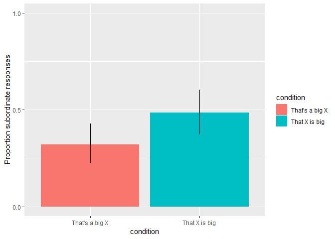
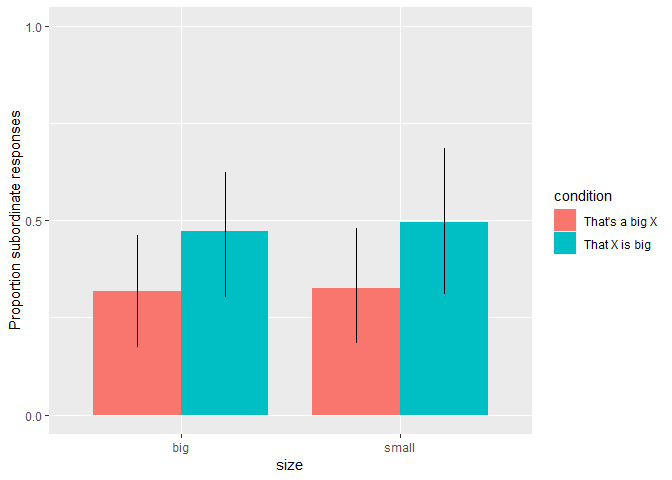
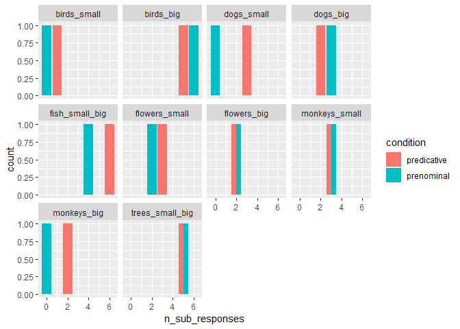

Comparison Class Elicitation Pilot
================
MH Tessler
7/29/2019

Experiment outline
==================

This script analyses the data from a comparison class elicitation pilot experiment (n=24). The goal of the pilot is to get a first impression of the design efficacy and a preliminary test of the hypothesis. In a between-subject design we manipulate the syntactic frame in which the subjects elicit the comparison class with respect to size of a target obejct: "That X is big" (predicative condition) and "That's a big X" (prenominal condition). We use both adjectives 'big' and 'small', depending on the target. The targets are chosen such that they are obviously big (or small) members of their superordinate category, but normal-sized for their subordinate category. A stimulus consists of a context group, for example different-sized dogs (superordinate category), and the target, a normal-sized great dane (a big dog) or a normal-sized chihuahua (a small dog) (subordinate categories).

Due to syntactic frame manipulation, the participans are expected to use different comparison classes (superordinate labels versus subordinate labels of the target) in order to communicate the situation presented to them in the stimulus.

We expect *more superordinate labels to occur in the prenominal condition*, since the NP restricts the comparison class more strongly to the category used in the NP. In contrast, we expect *a similar proportion of superordinate and subordinate labels in the predicative condition*, since the comparison class is less restricted.

### Procedure

The experiment is devided into two blocks, each consisting of three warm-up and three main trials, such that subjects can easily memorize target category labels. The warm-up trials are a simple labeling task. The subjects see pictures of two members of the same superordinate category, for example two dogs, each being a different subordinate, and a text box asking for a common label (the superordinate label is expected). The task is to label the pictures. The goal of this task to motivate speakers to produce subordinate category labels and to familiarize them with the target labels, since the warm-up trial pictures include the main trial target pictures. They were given feedback on the labels and could proceed only after correcting the entered answer to the suggested one.

The main trials set the situationsl context via an object parade picture. Then the participants see an additional parade member, the target object, which they are supposed to point out to a friend.

The syntactic structure of the reponse is the main condition (prenominal versus predicative, randomly sampled between-subject), the size of the target in comparison to the superordinate class is also randomly sampled (within-subject). The pairings of the target and the adjective are constant: i. e. if the target is a chihuahua, the sentence always includes the adjective "small", if it is a great dane, it would always be "big".

``` r
library(tidyverse)
```

    ## -- Attaching packages ----------------------------------------------------- tidyverse 1.2.1 --

    ## v ggplot2 3.1.0     v purrr   0.2.5
    ## v tibble  1.4.2     v dplyr   0.7.7
    ## v tidyr   0.8.2     v stringr 1.3.1
    ## v readr   1.1.1     v forcats 0.3.0

    ## -- Conflicts -------------------------------------------------------- tidyverse_conflicts() --
    ## x dplyr::filter() masks stats::filter()
    ## x dplyr::lag()    masks stats::lag()

``` r
library(kableExtra)
```

    ## Warning: package 'kableExtra' was built under R version 3.5.3

``` r
contexts <- data.frame("Superordinate" = c( "small target", "big target"), "Dogs"=c("chihuahua", "great dane"), "Fish"=c("swordfish", "goldfish"), "Primates"=c("gorilla", "spider monkey"), "Birds"=c("swan", "hummingbird"), "Flowers"=c("sunflower", "daisy"), "Trees"=c("redwood", "bonsai"), stringsAsFactors = F)

knitr::kable(contexts, align = "c",  padding= 2, caption = "Overview of contexts and targets") %>% kable_styling(bootstrap_options = c("striped", "hover", "condensed"))
```

<table class="table table-striped table-hover table-condensed" style="margin-left: auto; margin-right: auto;">
<caption>
Overview of contexts and targets
</caption>
<thead>
<tr>
<th style="text-align:center;">
Superordinate
</th>
<th style="text-align:center;">
Dogs
</th>
<th style="text-align:center;">
Fish
</th>
<th style="text-align:center;">
Primates
</th>
<th style="text-align:center;">
Birds
</th>
<th style="text-align:center;">
Flowers
</th>
<th style="text-align:center;">
Trees
</th>
</tr>
</thead>
<tbody>
<tr>
<td style="text-align:center;">
small target
</td>
<td style="text-align:center;">
chihuahua
</td>
<td style="text-align:center;">
swordfish
</td>
<td style="text-align:center;">
gorilla
</td>
<td style="text-align:center;">
swan
</td>
<td style="text-align:center;">
sunflower
</td>
<td style="text-align:center;">
redwood
</td>
</tr>
<tr>
<td style="text-align:center;">
big target
</td>
<td style="text-align:center;">
great dane
</td>
<td style="text-align:center;">
goldfish
</td>
<td style="text-align:center;">
spider monkey
</td>
<td style="text-align:center;">
hummingbird
</td>
<td style="text-align:center;">
daisy
</td>
<td style="text-align:center;">
bonsai
</td>
</tr>
</tbody>
</table>
Data analysis
-------------

``` r
#library(tidyverse)
library(tidyboot)
```

    ## Warning: package 'tidyboot' was built under R version 3.5.3

``` r
# read in data
d <- read_csv('./../data/results_4_comparison-class-production_24.csv')
```

    ## Parsed with column specification:
    ## cols(
    ##   .default = col_character(),
    ##   submission_id = col_integer(),
    ##   experiment_id = col_integer(),
    ##   enjoyment = col_integer(),
    ##   age = col_integer(),
    ##   trial_number = col_integer(),
    ##   startTime = col_double(),
    ##   fairprice = col_double()
    ## )

    ## See spec(...) for full column specifications.

``` r
#first look at the data
glimpse(d)
```

    ## Observations: 472
    ## Variables: 35
    ## $ submission_id   <int> 60, 60, 60, 60, 60, 60, 60, 60, 60, 60, 60, 60...
    ## $ response1       <chr> "monkey", "monkey", "monkey", "monkey", "monke...
    ## $ startDate       <chr> "Thu Jul 25 2019 14:31:15 GMT-0700 (Pacific Da...
    ## $ context_picture <chr> NA, NA, NA, NA, NA, NA, NA, NA, NA, NA, NA, NA...
    ## $ experiment_id   <int> 4, 4, 4, 4, 4, 4, 4, 4, 4, 4, 4, 4, 4, 4, 4, 4...
    ## $ picture2        <chr> "images/gorilla.jpg", "images/gorilla.jpg", "i...
    ## $ correct1        <chr> "spider monkey", "spider monkey", "spider monk...
    ## $ question1       <chr> "This is a", "This is a", "This is a", "This i...
    ## $ problems        <chr> "No", "No", "No", "No", "No", "No", "No", "No"...
    ## $ enjoyment       <int> 1, 1, 1, 1, 1, 1, 1, 1, 1, 1, 1, 1, 1, 1, 1, 1...
    ## $ hit_id          <chr> "3OYHVNTV5TMK21R7TUK0R26WHDAOKT", "3OYHVNTV5TM...
    ## $ assignment_id   <chr> "3ZV9H2YQQEVPYWQVPCODFUY4TUWW3F", "3ZV9H2YQQEV...
    ## $ correct2        <chr> "gorilla", "gorilla", "gorilla", "gorilla", "g...
    ## $ understand      <chr> "yes", "yes", "yes", "yes", "yes", "yes", "yes...
    ## $ text            <chr> "Please label the pictures below.", "Please la...
    ## $ sentence        <chr> NA, NA, NA, NA, NA, NA, NA, NA, NA, NA, NA, NA...
    ## $ age             <int> 41, 41, 41, 41, 41, 41, 41, 41, 41, 41, 41, 41...
    ## $ response        <chr> NA, NA, NA, NA, NA, NA, NA, NA, NA, NA, NA, NA...
    ## $ comments        <chr> "There are a few issues with this experiment. ...
    ## $ picture1        <chr> "images/spidermonkey.jpg", "images/spidermonke...
    ## $ response3       <chr> "primates", "apes", "apes", "apes", "apes", "p...
    ## $ education       <chr> "higher_degree", "higher_degree", "higher_degr...
    ## $ worker_id       <chr> "ANNVWKERLZG9A", "ANNVWKERLZG9A", "ANNVWKERLZG...
    ## $ languages       <chr> "English", "English", "English", "English", "E...
    ## $ sex             <chr> "male", "male", "male", "male", "male", "male"...
    ## $ RT              <chr> NA, NA, NA, NA, NA, NA, NA, NA, NA, NA, NA, NA...
    ## $ correct3        <chr> "monkeys|apes", "monkeys|apes", "monkeys|apes"...
    ## $ context         <chr> NA, NA, NA, NA, NA, NA, NA, NA, NA, NA, NA, NA...
    ## $ trial_number    <int> 1, 1, 1, 1, 1, 1, 1, 1, 1, 2, 2, 3, 3, 1, 2, 3...
    ## $ startTime       <dbl> 1.56409e+12, 1.56409e+12, 1.56409e+12, 1.56409...
    ## $ picture         <chr> NA, NA, NA, NA, NA, NA, NA, NA, NA, NA, NA, NA...
    ## $ fairprice       <dbl> 1.50, 1.50, 1.50, 1.50, 1.50, 1.50, 1.50, 1.50...
    ## $ question2       <chr> "These are both", "These are both", "These are...
    ## $ response2       <chr> "gorilla", "ape", "gorilla", "gorilla", "goril...
    ## $ trial_name      <chr> "warmup", "warmup", "warmup", "warmup", "warmu...

``` r
# comments
d_comments <- d %>%
  distinct(submission_id, problems, comments, fairprice)
```

The design seems to work, no technical issues occured. The participants recruited via MTurk were paid $1.10.

Spliting data into main and warm-up, excluding participants
-----------------------------------------------------------

``` r
# make sure how participants indicate their native language 
# sometimes participants use only "en" or "eng" for english
# excluded non-native speakers 
d %>% distinct(d$languages) %>% glimpse()
```

    ## Observations: 4
    ## Variables: 1
    ## $ `d$languages` <chr> "English", "english", "English, Spanish", "Engli...

``` r
d_filt <- d %>% 
  filter(grepl("English", languages, ignore.case = T)) %>%
  select(submission_id, trial_name, trial_number, question1, question2, response, response1, response2, response3, correct1, correct2, correct3, picture, context_picture)

glimpse(d_filt)
```

    ## Observations: 472
    ## Variables: 14
    ## $ submission_id   <int> 60, 60, 60, 60, 60, 60, 60, 60, 60, 60, 60, 60...
    ## $ trial_name      <chr> "warmup", "warmup", "warmup", "warmup", "warmu...
    ## $ trial_number    <int> 1, 1, 1, 1, 1, 1, 1, 1, 1, 2, 2, 3, 3, 1, 2, 3...
    ## $ question1       <chr> "This is a", "This is a", "This is a", "This i...
    ## $ question2       <chr> "These are both", "These are both", "These are...
    ## $ response        <chr> NA, NA, NA, NA, NA, NA, NA, NA, NA, NA, NA, NA...
    ## $ response1       <chr> "monkey", "monkey", "monkey", "monkey", "monke...
    ## $ response2       <chr> "gorilla", "ape", "gorilla", "gorilla", "goril...
    ## $ response3       <chr> "primates", "apes", "apes", "apes", "apes", "p...
    ## $ correct1        <chr> "spider monkey", "spider monkey", "spider monk...
    ## $ correct2        <chr> "gorilla", "gorilla", "gorilla", "gorilla", "g...
    ## $ correct3        <chr> "monkeys|apes", "monkeys|apes", "monkeys|apes"...
    ## $ picture         <chr> NA, NA, NA, NA, NA, NA, NA, NA, NA, NA, NA, NA...
    ## $ context_picture <chr> NA, NA, NA, NA, NA, NA, NA, NA, NA, NA, NA, NA...

``` r
# extract main trials 
d_main <- d_filt %>% 
  filter(trial_name == "main") %>%
  select(submission_id, trial_number, question1, question2, response, picture, context_picture)

# extract warm-up trials 
d_warmup <- d_filt %>% filter(trial_name =="warmup") %>% 
  select(submission_id, trial_number, response1, correct1, response2, correct2, response3, correct3)

# NB: in the warmup trials, trial_number includes two distinct trials (first block, second block), i.e. trial_number 1 is both the first warm-up view of the first and the second warm-up block
d_warmup %>%
  group_by(submission_id, trial_number, correct3) %>%
  count() %>%
  ungroup() %>%
  tidyboot_mean(column = n) # calculate mean of attempts participants needed for the warm-up completion
```

    ## # A tibble: 1 x 5
    ##       n empirical_stat ci_lower  mean ci_upper
    ##   <int>          <dbl>    <dbl> <dbl>    <dbl>
    ## 1   144           2.28     1.95  2.27     2.65

On average, participants had to re-enter the labels twice per two warm-up views, meaning that they corrected they initial answer once to proceed to the next view.

Categorizing the data
---------------------

``` r
# question1 and question2 are the sentence parts coded in the experiment 

d_main_responseCat <- d_main %>%
  rowwise() %>%
  mutate(
    question2 = ifelse(is.na(question2), "X", question2), # rewrite NAs as X
    condition = ifelse(question2 == "X", "prenominal", "predicative"), # categorize condition
    size = ifelse(
      ((question1 == "That's a small") || (question2 == "is small.")), # categorize size
      "small",
      "big")
    ) %>%
  mutate( # categorize responses 
    response_cat = ifelse(
      response %in% c("ape", "primate", "bird", "dog", "fish", "flower", "monkey", "tree"), "super", "sub"),
    response_num = ifelse(response_cat == "sub", 1, 0),
    response_label = "sub"
  )
```

Proportion of subordinate responses by condition
------------------------------------------------

The proportion of subordinate responses is the dependent variable we test by manipulating the syntactic condition: "That's a big X" (prenominal) versus "That X is big" (predicative). The results confirm our expectations that participants use more subordinate labels in the predicative condition.

``` r
d_main_summary <- d_main_responseCat %>%
  group_by(condition, response_label) %>%
  tidyboot_mean(column = response_num) %>% # calculate proportion of subordinate labels in the different conditions 
  ungroup() %>%
  mutate(condition = factor(condition, 
                            levels = c("prenominal", "predicative"),
                            labels= c("That's a big X", "That X is big")))
```

    ## Warning: Grouping rowwise data frame strips rowwise nature

``` r
ggplot(d_main_summary, aes(x = condition, fill = condition,
                           y = mean, ymin = ci_lower, ymax = ci_upper))+
  geom_col(position = position_dodge())+
  geom_linerange(position = position_dodge())+
  labs( y = "Proportion subordinate responses")+
  scale_y_continuous(limits = c(0, 1), breaks = c(0, 0.5, 1))
```

    ## Warning: Width not defined. Set with `position_dodge(width = ?)`



Proportion of subordinate labels in big vs. small trials
--------------------------------------------------------

We check if there is any proportional difference between the trials with different target size. The size does not seem to have a significant effect.

``` r
d_main_summary_bySize <- d_main_responseCat %>%
  group_by(condition, size, response_label) %>%
  tidyboot_mean(column = response_num) %>%
  ungroup() %>%
  mutate(condition = factor(condition, 
                            levels = c("prenominal", "predicative"),
                            labels= c("That's a big X", "That X is big")))
```

    ## Warning: Grouping rowwise data frame strips rowwise nature

``` r
ggplot(d_main_summary_bySize, aes(x = size, fill = condition,
                           y = mean, ymin = ci_lower, ymax = ci_upper))+
  geom_col(position = position_dodge(0.8), width = 0.8)+
  geom_linerange(position = position_dodge(0.8))+
  labs( y = "Proportion subordinate responses")+
  scale_y_continuous(limits = c(0, 1), breaks = c(0, 0.5, 1))
```



Consistency of choosing a response category by subject
------------------------------------------------------

Do participants switch between superordinate and subordinate labels within the experiment? Confirming our expectations, the subjects in the predicative rather stick to the subordinate labels throughout the trials.

``` r
d_main_responseCat %>%
  group_by(submission_id, condition, response_label) %>%
  summarize(n_sub_responses = sum(response_num)) %>%
  ungroup() %>%
  mutate(condition = factor(condition, 
                            levels = c("prenominal", "predicative"),
                            labels= c("That's a big X (prenominal)", "That X is big (predicative)"))) %>%
  ggplot(., aes( x = n_sub_responses ))+
  geom_bar()+
  facet_wrap(~condition)
```

    ## Warning: Grouping rowwise data frame strips rowwise nature


Proportion of subordinate responses by item (context)
-----------------------------------------------------

For each context, there is a pair of targets (a big and a small one). The targets seem to elicit different proportions of subordinate lables. The most effective ones seem to be the swan, the chihuahua and the bonsai. However, the results are not robust due to a small sample size.

``` r
d_main_responseCat %>% count(context_picture, condition) %>% glimpse()
```

    ## Warning: Grouping rowwise data frame strips rowwise nature

    ## Observations: 20
    ## Variables: 3
    ## $ context_picture <chr> "images/bird-parade-small.png", "images/bird-p...
    ## $ condition       <chr> "predicative", "prenominal", "predicative", "p...
    ## $ n               <int> 5, 5, 6, 8, 5, 10, 6, 3, 11, 13, 5, 4, 6, 9, 4...

``` r
d_main_responseCat %>%
  group_by(context_picture, condition,  response_label) %>%
  summarize(n_sub_responses = sum(response_num)) %>%
  ungroup() %>%
  mutate(context_picture = factor(context_picture, 
                            levels = c("images/bird-parade-small.png", "images/bird-parade.png", "images/dog_parade_small.png", "images/dog_parade.png", "images/fish-parade.png", "images/flower-parade-small.png", "images/flower-parade.png", "images/monkey-parade-small.png", "images/monkey-parade.png", "images/tree-parade.png"),
                            labels= c("birds_small", "birds_big", "dogs_small", "dogs_big", "fish_small_big", "flowers_small", "flowers_big", "monkeys_small", "monkeys_big", "trees_small_big"))) %>%
  ggplot(., aes( x = n_sub_responses, fill=condition ))+
  geom_bar(position = position_dodge())+
  facet_wrap(~context_picture)
```

    ## Warning: Grouping rowwise data frame strips rowwise nature



``` r
# the fish and tree plots show both trials with small and big targets
```

Issues, Suggestions, Discussion
-------------------------------

The pilot data supports our hypothesis.

For the main experiment, a few improvements and suggestions might be incorporated.

The variable coding the experiment script will be improved to avoid the mutations here in the analysis. Furthermore, the primates trial will be altered to be consistent between monkeys and apes. The label 'primates' will also be included as a correct answer in the warm-up trials. Further trials might be included.

To make sure the choice of subordinate labels is not confounded with other effects, we could run an experiment with warm-up tagets different from the main targets. Yet participants might not know the subordinate labels in the main trials. A possibility to improve that is to use photos instead of cartoons.

Additionally, we suggest another experiment including main trials where target pictures are paired with 'forced', more surprising / informative adjectives for their respective subordinate category, e. g. 'big chihuahua' and 'small great dane'.
