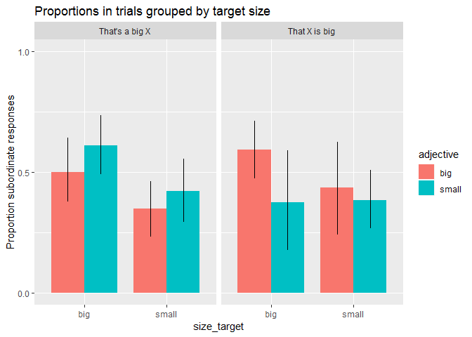
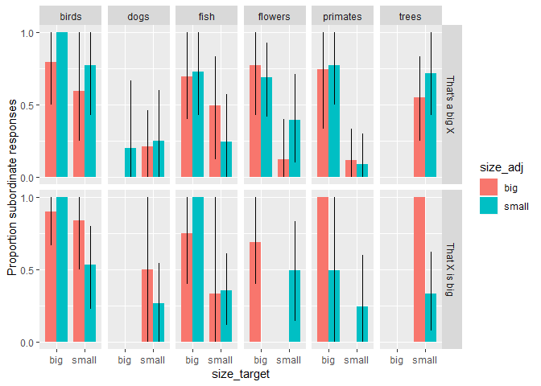

Comparison Class Elicitation With Superordinate Context Items
================
Polina Tsvilodub
7/29/2019

# Experiment outline

This script analyses the data from a comparison class elicitation pilot
experiment with different adjective and target pais (n=80).

We expect *more subordinate labels to occur in the incongruent
condition*. In contrast, we expect *a similar proportion of
superordinate and subordinate labels as in the previous experiment in
the congruent condition*. Overall proportion of *subordinate labels
should be higher in the predicative condition*. The proportion of
superordinate labels is expected to be higher due to superordinate
contextual competitors.

### Procedure

The pairings of the target and the adjective are altered in this
experiment: i. e. in the congruent condition, if target is a chihuahua,
the sentence includes the adjective “small”, if it is a great dane, it
includes “big”. In the incongruent (critical) condition, if the target
is a chihuahua, the sentence includes the adjective “big”, if the target
is a great dane, it includes “small”
    (between-subject).

## Data analysis

``` r
library(tidyverse)
```

    ## -- Attaching packages --------------------------------------- tidyverse 1.2.1 --

    ## v ggplot2 3.1.0     v purrr   0.2.5
    ## v tibble  1.4.2     v dplyr   0.7.7
    ## v tidyr   0.8.2     v stringr 1.3.1
    ## v readr   1.1.1     v forcats 0.3.0

    ## -- Conflicts ------------------------------------------ tidyverse_conflicts() --
    ## x dplyr::filter() masks stats::filter()
    ## x dplyr::lag()    masks stats::lag()

``` r
library(tidyboot)
```

    ## Warning: package 'tidyboot' was built under R version 3.5.3

``` r
# read in data
d <- read_csv('./../data/results_6_super-comp-class-exp_80.csv')
```

    ## Parsed with column specification:
    ## cols(
    ##   .default = col_character(),
    ##   submission_id = col_integer(),
    ##   age = col_integer(),
    ##   enjoyment = col_integer(),
    ##   experiment_id = col_integer(),
    ##   startTime = col_double(),
    ##   trial_number = col_integer()
    ## )

    ## See spec(...) for full column specifications.

``` r
#first look at the data
glimpse(d)
```

    ## Observations: 480
    ## Variables: 33
    ## $ submission_id   <int> 255, 255, 255, 255, 255, 255, 254, 254, 254, 2...
    ## $ RT              <chr> NA, NA, NA, NA, NA, NA, NA, NA, NA, NA, NA, NA...
    ## $ adj_cond        <chr> "congruent", "congruent", "congruent", "congru...
    ## $ age             <int> 55, 55, 55, 55, 55, 55, 28, 28, 28, 28, 28, 28...
    ## $ assignment_id   <chr> "3FDJT1UU75W1HBJIEHT36G2TMB75KX", "3FDJT1UU75W...
    ## $ botresponse     <chr> "patricia", "patricia", "patricia", "patricia"...
    ## $ comments        <chr> "This was very interesting", "This was very in...
    ## $ condition       <chr> "prenominal", "prenominal", "prenominal", "pre...
    ## $ context         <chr> "You see a parade of animals.", "You see a par...
    ## $ context_picture <chr> "images/birds_parade_small.png", "images/anima...
    ## $ education       <chr> "graduated_college", "graduated_college", "gra...
    ## $ enjoyment       <int> 1, 1, 1, 1, 1, 1, 1, 1, 1, 1, 1, 1, 1, 1, 1, 1...
    ## $ experiment_id   <int> 6, 6, 6, 6, 6, 6, 6, 6, 6, 6, 6, 6, 6, 6, 6, 6...
    ## $ fairprice       <chr> "0.6", "0.6", "0.6", "0.6", "0.6", "0.6", "0.6...
    ## $ hit_id          <chr> "3MGHRFQY2LDUJPO5VOJGA9PPI0WY0O", "3MGHRFQY2LD...
    ## $ item            <chr> "birds", "dogs", "primates", "trees", "fish", ...
    ## $ languages       <chr> "English", "English", "English", "English", "E...
    ## $ picture         <chr> "images/hummingbird.png", "images/great-dane.p...
    ## $ problems        <chr> "no", "no", "no", "no", "no", "no", "none", "n...
    ## $ question1       <chr> "That's a small", "That's a big", "That's a sm...
    ## $ question2       <chr> NA, NA, NA, NA, NA, NA, "is big.", "is small."...
    ## $ response        <chr> "hummingbird", "dog", "monkey", "tree", "blue ...
    ## $ sentence        <chr> "You say to your friend:", "You say to your fr...
    ## $ sex             <chr> "female", "female", "female", "female", "femal...
    ## $ size_adj        <chr> "small", "big", "small", "small", "big", "big"...
    ## $ size_target     <chr> "small", "big", "small", "small", "big", "big"...
    ## $ startDate       <chr> "Mon Aug 05 2019 16:14:50 GMT-0400 (Eastern Da...
    ## $ startTime       <dbl> 1.565036e+12, 1.565036e+12, 1.565036e+12, 1.56...
    ## $ text            <chr> "This one is also in the parade.", "This one i...
    ## $ trial_name      <chr> "main1", "main1", "main1", "main2", "main2", "...
    ## $ trial_number    <int> 1, 2, 3, 1, 2, 3, 1, 2, 3, 1, 2, 3, 1, 2, 3, 1...
    ## $ understand      <chr> "yes", "yes", "yes", "yes", "yes", "yes", "yes...
    ## $ worker_id       <chr> "A1BNYBF79IQ89T", "A1BNYBF79IQ89T", "A1BNYBF79...

``` r
# comments
d_comments <- d %>%
  distinct(submission_id, problems, comments, fairprice)
```

The participants recruited via MTurk were paid $0.50.

\#\#Spliting data into main and warm-up, excluding participants

6 participants are excluded because of their native language. There are
participants using upper case in the bot captcha, but they are not
excluded in this analysis.

``` r
# make sure how participants indicate their native language 
# sometimes participants use only "en" or "eng" for english
# excluded non-native speakers 
d %>% distinct(d$languages) %>% View()
d_langs <- d %>% mutate(
  languages = ifelse(languages == "yes", "English", languages)
) %>% mutate(
  languages = ifelse(is.na(languages), "X", languages)
) 

d_filt <- d %>% 
  filter(grepl("English", languages, ignore.case = T)) %>%
  select(submission_id, trial_name, trial_number, size_adj, item, botresponse, response, condition, size_target, adj_cond)

glimpse(d_filt)
```

    ## Observations: 450
    ## Variables: 10
    ## $ submission_id <int> 255, 255, 255, 255, 255, 255, 253, 253, 253, 253...
    ## $ trial_name    <chr> "main1", "main1", "main1", "main2", "main2", "ma...
    ## $ trial_number  <int> 1, 2, 3, 1, 2, 3, 1, 2, 3, 1, 2, 3, 1, 2, 3, 1, ...
    ## $ size_adj      <chr> "small", "big", "small", "small", "big", "big", ...
    ## $ item          <chr> "birds", "dogs", "primates", "trees", "fish", "f...
    ## $ botresponse   <chr> "patricia", "patricia", "patricia", "patricia", ...
    ## $ response      <chr> "hummingbird", "dog", "monkey", "tree", "blue an...
    ## $ condition     <chr> "prenominal", "prenominal", "prenominal", "preno...
    ## $ size_target   <chr> "small", "big", "small", "small", "big", "big", ...
    ## $ adj_cond      <chr> "congruent", "congruent", "congruent", "congruen...

``` r
d_filt %>% distinct(d_filt$botresponse) %>% View()
# extract main trials 
d_main <- d_filt %>% 
  select(submission_id, trial_number, response, size_adj, item, condition, size_target, adj_cond)
```

## Categorizing the data

About 30 responses excluded due to task
misundersatnding.

``` r
# question1 and question2 are the sentence parts coded in the experiment 
# look at the different responses provided and categorize them 
d_main %>% distinct(d_main$response) %>% View()

d_main_valid <- subset(d_main, !(response %in% c("horse", "house", "koala", "butterfly", "squirrel", "shark", "whale", "flamingo", "snake", "rose", "crab", "pug", "tiger", "tail", "parade", "fox", "deer", "item"))) 
d_main_valid$response[d_main_valid$response == "gold fish"] <- "goldfish"
d_main_valid$response[d_main_valid$response == "straight tail monkey"] <- "monkey"
d_main_valid$response[d_main_valid$response == "scaly fish"] <- "fish"
d_main_valid$response[d_main_valid$response == "blue and white fish"] <- "fish"
d_main_valid$response[d_main_valid$response == "grey dog"] <- "dog"

  
d_main_responseCat <- d_main_valid %>%
  rowwise() %>%
  mutate( # categorize responses 
    response_cat =
      ifelse(
      tolower(response) %in% c("ape", "primate", "bird", "dog", "fish", "flower", "monkey", "tree", "leaf", "twig", "branch", "bush"), "basic", "sub"),
    
    response_num = ifelse(response_cat == "sub", 1, 0),
    response_label = "sub"
  )
d_main_responseCat$response_cat[d_main_responseCat$response == "plant"] <- "super"
d_main_responseCat$response_cat[d_main_responseCat$response == "animal"] <- "super"
```

## Response category distribution

``` r
d_main_responseCat %>% mutate(condition = factor(condition, 
                            levels = c("prenominal", "predicative"),
                            labels= c("That's a big X", "That X is big"))) %>% ggplot(aes(x=response_cat, fill=adj_cond)) +geom_bar(position=position_dodge()) + facet_wrap(~condition)
```

<!-- -->

## Proportion of subordinate responses by condition, separated by congruency

The proportion of subordinate responses is the dependent variable we
test by manipulating the syntactic condition: “That’s a big X”
(prenominal) versus “That X is big” (predicative).

Count of different conditions: about 160 incongruent observations, about
240 congruent observations. Given the task description, the confusion
among participants seems to happens especially in incongruent trials.

``` r
d_main_summary <- d_main_responseCat %>%
  group_by(condition, response_label, adj_cond) %>%
  tidyboot_mean(column = response_num) %>% # calculate proportion of subordinate labels in the different conditions 
  ungroup() %>%
  mutate(condition = factor(condition, 
                            levels = c("prenominal", "predicative"),
                            labels= c("That's a big X", "That X is big")),
         adj_cond = factor(adj_cond, 
                            levels=c("congruent", "incongruent"), 
                           labels = c("great dane : big", "great dane : small")))
```

    ## Warning: Grouping rowwise data frame strips rowwise nature

``` r
ggplot(d_main_summary, aes(x = adj_cond, fill = adj_cond,
                           y = mean, ymin = ci_lower, ymax = ci_upper))+
  geom_col(position = position_dodge(0.8))+
  geom_linerange(position = position_dodge(0.8))+
  labs( y = "Proportion subordinate responses")+
  scale_y_continuous(limits = c(0, 1), breaks = c(0, 0.5, 1))+
  ggtitle("The proportion of subordinate responses by syntactic condition")+
  facet_wrap(~condition)
```

<!-- -->

## Proportion of subordinate responses by congruence

``` r
d_main_congr <- d_main_responseCat %>%
  group_by(adj_cond, condition, response_label) %>%
  tidyboot_mean(column = response_num) %>% # calculate proportion of subordinate labels in the different conditions 
  ungroup() %>%
  mutate(condition = factor(condition, 
                            levels = c("prenominal", "predicative"),
                            labels= c("That's a big X", "That X is big")),
         adj_cond = factor(adj_cond, 
                            levels=c("congruent", "incongruent"), 
                           labels = c("great dane : big", "great dane : small")))
```

    ## Warning: Grouping rowwise data frame strips rowwise nature

``` r
ggplot(d_main_congr, aes(x = condition, fill = condition,
                           y = mean, ymin = ci_lower, ymax = ci_upper))+
  geom_col(position = position_dodge(0.8))+
  geom_linerange(position = position_dodge(0.8))+
  labs( y = "Proportion subordinate responses")+
  scale_y_continuous(limits = c(0, 1), breaks = c(0, 0.5, 1))+
  ggtitle("Proportion of subordinate responses by congruence")+
  facet_wrap(~adj_cond)
```

<!-- -->

## Proportion of subordinate labels in big vs. small trials

We check if there is any proportional difference between the trials with
different target size. The size does not seem to have a significant
effect.

``` r
d_main_responseCat %>% group_by(size_target, adj_cond) %>% count()
```

    ## Warning: Grouping rowwise data frame strips rowwise nature

    ## # A tibble: 4 x 3
    ## # Groups:   size_target, adj_cond [4]
    ##   size_target adj_cond        n
    ##   <chr>       <chr>       <int>
    ## 1 big         congruent     122
    ## 2 big         incongruent    83
    ## 3 small       congruent     125
    ## 4 small       incongruent    88

``` r
d_main_summary_bySize <- d_main_responseCat %>%
  group_by(condition, size_target, adj_cond, size_adj, response_label) %>%
  tidyboot_mean(column = response_num) %>%
  ungroup() %>%
  mutate(condition = factor(condition, 
                            levels = c("prenominal", "predicative"),
                            labels= c("That's a big X", "That X is big")),
         adjective = factor(size_adj, 
                            levels=c("big", "small"), 
                           labels = c("big", "small")))
```

    ## Warning: Grouping rowwise data frame strips rowwise nature

``` r
# big and small indicate the size of the target here 
ggplot(d_main_summary_bySize, aes(x = size_target, fill = adjective, 
                           y = mean, ymin = ci_lower, ymax = ci_upper))+
  geom_col(position = position_dodge(0.8), width = 0.8)+
  geom_linerange(position = position_dodge(0.8))+
  labs( y = "Proportion subordinate responses")+
  facet_wrap(~condition)+
  scale_y_continuous(limits = c(0, 1), breaks = c(0, 0.5, 1))+ ggtitle("Proportions in trials grouped by target size")
```

<!-- -->

## Consistency of choosing a response category by subject

Do participants switch between superordinate and subordinate labels
within the experiment?

``` r
d_main_responseCat %>%
  group_by(submission_id, adj_cond, condition, response_label) %>%
  summarize(n_sub_responses = sum(response_num)) %>%
  ungroup() %>%
  mutate(condition = factor(condition, 
                            levels = c("prenominal", "predicative"),
                            labels= c("That's a big X (prenominal)", "That X is big (predicative)")),
         adj_cond = factor(adj_cond, 
                            levels=c("congruent", "incongruent"), 
                           labels = c("great dane : big", "great dane : small"))) %>%
  ggplot(., aes( x = n_sub_responses, fill = adj_cond))+
  geom_bar(position=position_dodge())+
  facet_grid(adj_cond~condition) + ggtitle("Number of subordinate responses uttered per participant in the 3 trials")
```

    ## Warning: Grouping rowwise data frame strips rowwise nature

<!-- -->

## Proportion of subordinate responses by item (context)

For each context, there is a pair of targets (a big and a small one).
The targets seem to elicit different proportions of subordinate labels.

``` r
d_main_responseCat %>% count(item, condition) %>% glimpse()
```

    ## Warning: Grouping rowwise data frame strips rowwise nature

    ## Observations: 12
    ## Variables: 3
    ## $ item      <chr> "birds", "birds", "dogs", "dogs", "fish", "fish", "f...
    ## $ condition <chr> "predicative", "prenominal", "predicative", "prenomi...
    ## $ n         <int> 32, 40, 28, 38, 29, 37, 33, 40, 32, 37, 32, 40

``` r
d_main_responseCat %>%
  group_by(condition, item, size_adj, size_target, response_label) %>%
  tidyboot_mean(column = response_num) %>%
  ungroup() %>%
  mutate(condition = factor(condition, 
                            levels = c("prenominal", "predicative"),
                            labels= c("That's a big X", "That X is big"))
         ) %>%

# big and small indicate the adjective actually used 
ggplot(., aes(x = size_target, fill = size_adj, 
                           y = mean, ymin = ci_lower, ymax = ci_upper))+
  geom_col(position = position_dodge(0.8), width = 0.8)+
  geom_linerange(position = position_dodge(0.8))+
  labs( y = "Proportion subordinate responses")+
  facet_grid(condition~item)+
  scale_y_continuous(limits = c(0, 1), breaks = c(0, 0.5, 1))
```

    ## Warning: Grouping rowwise data frame strips rowwise nature

<!-- -->

``` r
# leave this grouping or interchange adj_cond and condition?
```

``` r
d_main_responseCat %>%
  group_by(condition, item,  response_label) %>%
  summarize(n_sub_responses = sum(response_num)) %>%
  ungroup() %>%
  mutate(condition = factor(condition, 
                            levels = c("prenominal", "predicative"),
                            labels= c("That's a big X", "That X is big"))
         ) %>%

# big and small indicate the adjective actually used 
ggplot(., aes(x = n_sub_responses
                        ))+
  geom_bar(position = position_dodge(0.8), width = 0.8)+
 
  labs( y = "Proportion subordinate responses")+
  facet_grid(condition~item)
```

    ## Warning: Grouping rowwise data frame strips rowwise nature

<!-- -->

``` r
# leave this grouping or interchange adj_cond and condition?
```

``` r
d_main_responseCat %>%
  group_by(condition, item, size_target, response_label) %>%
  summarize(n_sub_responses = sum(response_num)) %>%
  ungroup() %>%
  mutate(condition = factor(condition, 
                            levels = c("prenominal", "predicative"),
                            labels= c("That's a big X", "That X is big"))
         ) %>%

# big and small indicate the adjective actually used 
ggplot(., aes(x = n_sub_responses, fill = size_target
                        ))+
  geom_bar(position = position_dodge(0.8), width = 0.8)+
 
  labs( y = "Proportion subordinate responses")+
  facet_grid(condition~item)
```

    ## Warning: Grouping rowwise data frame strips rowwise nature

<!-- -->
